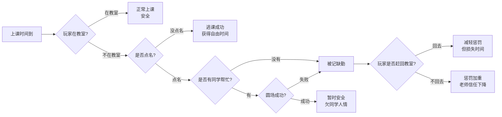

# 人员 1 事件内容策划 v2：交互、突发事件与长任务链

> **历史草稿说明**：本文件保留为早期策划记录，不再作为 AI 编程主规范。
>
> 当前请优先参考：
> - `plan/校园生活模拟器 AI 编程事件规范（主文档）.md`
> - `plan/校园生活模拟器 AI 编程事件规范（附录速查）.md`
>
> 本文件的价值主要在于保留当时对“常规交互 / 突发事件 / 长任务链”分层思路的讨论痕迹。

## 1. 本版修改重点

本版根据小组反馈重新整理。

之前的问题：

- 吃饭、不吃饭、打游戏、读书这些行为被写成了“剧情选项”。
- 但实际上这些应该由玩家走到交互点主动触发，而不是每次弹出选择题。
- 真正需要选项的是突发事件、一次性事件、主线事件和任务链节点。

本版改为三层结构：

| 类型 | 是否需要选项 | 说明 |
| --- | --- | --- |
| 常规交互 | 通常不需要 | 玩家走到交互点按 Enter，直接执行行为 |
| 突发事件 | 需要 | 打断玩家计划，让玩家做选择 |
| 长任务链 | 需要 | 前面选择影响后面节点，形成连续剧情 |

核心原则：

```text
常规行为 = 玩家自己走过去做
突发事件 = 系统突然给玩家抛问题
任务链 = 多个事件节点连续影响后续结果
```

## 2. 常规交互：不要做成选项

常规交互应该像现在项目里的家具交互点一样：

```text
玩家走到地点 -> 按 Enter -> 直接执行 -> 显示一句结果反馈
```

例如：

- 玩家去食堂窗口，就是打饭。
- 玩家去食堂餐桌，就是吃饭。
- 玩家去宿舍电脑，就是打游戏。
- 玩家去图书馆书架，就是选书。
- 玩家去图书馆桌子，就是读书。
- 玩家去床边，就是睡觉或休息。

这些不需要每次都弹“选项 A / 选项 B / 选项 C”。

### 2.1 食堂常规交互

| 交互 ID | 交互点 | 触发地点 | 可用时段 | 反馈文本 |
| --- | --- | --- | --- | --- |
| `cafeteria_get_meal` | 打饭窗口 | 食堂 | 早餐/午饭/晚饭 | 你在窗口打好当前时段的餐食。具体是早餐、午饭还是晚饭，由当前游戏时间决定。 |
| `cafeteria_eat_table` | 餐桌 | 食堂 | 早餐/午饭/晚饭 | 你坐下来吃完了这顿饭。身体恢复了一些，时间也悄悄过去了。 |

说明：

- 食堂不需要分早餐窗口、午饭窗口、晚饭窗口。
- 同一批打饭窗口在不同时间开放，就代表不同餐食。
- 程序上可以由 `TimeSystem` 判断当前是早餐、午饭还是晚饭。
- 吃什么套餐、花多少钱、加多少属性，可以由人员 2 和人员 3 定。
- 人员 1 只需要提供反馈文本。
- 如果想增加趣味，可以额外做“食堂最后一份鸡腿”这种突发事件，而不是把每次吃饭都做成选项。

### 2.2 宿舍常规交互

| 交互 ID | 交互点 | 触发地点 | 可用时段 | 反馈文本 |
| --- | --- | --- | --- | --- |
| `dorm_sleep` | 床 | 宿舍 | 晚上/深夜 | 你关灯躺下。无论今天过得怎么样，明天都会重新开始。 |
| `dorm_short_rest` | 床 | 宿舍 | 白天 | 你在床上躺了一会儿，疲惫稍微缓解，但时间也过去了。 |
| `dorm_study` | 书桌 | 宿舍 | 晚上/深夜 | 你打开台灯，开始复习。宿舍并不安静，但至少你坐下了。 |
| `dorm_play_games` | 书桌电脑 | 宿舍 | 晚上/深夜 | 你打开电脑打了几局游戏，心情短暂变好。只是再来一局的念头越来越危险。 |
| `dorm_check_phone_bed` | 床 | 宿舍 | 任意 | 你躺在床上掏出手机刷了一会儿。消息很多，真正重要的也许没几个。 |
| `dorm_check_phone_desk` | 书桌 | 宿舍 | 任意 | 你坐在桌前掏出手机看了看消息，本来只是想回一句，结果又多看了几分钟。 |

说明：

- 打游戏本身是常规交互。
- 手机不需要单独做一个地图交互点，可以依附在床或书桌交互里。
- 电脑固定在书桌上，不需要额外放一个独立电脑交互点。
- “宿舍断网”“社死朋友圈误发”“神秘泡面香”才是突发事件。

### 2.3 图书馆常规交互

| 交互 ID | 交互点 | 触发地点 | 可用时段 | 反馈文本 |
| --- | --- | --- | --- | --- |
| `library_browse_reference` | 参考书架 | 图书馆 | 图书馆开放时间 | 你翻了几本参考书，找到了一些看起来有用的资料。 |
| `library_browse_literature` | 文史书架 | 图书馆 | 图书馆开放时间 | 你翻到几段有意思的文字，心情变得安静了一些。 |
| `library_browse_science` | 理工书架 | 图书馆 | 图书馆开放时间 | 你找到了和课程相关的资料，知识点开始连起来。 |
| `library_read_table` | 阅读桌 | 图书馆 | 图书馆开放时间 | 你坐下读了一段时间。图书馆的安静让你更容易进入状态。 |
| `library_part_time_sort` | 还书车 | 图书馆 | 晚上 | 你帮忙整理归还的书。工作有点枯燥，但还算平静。 |

说明：

- 图书馆拿书/选书交互只需要判断“图书馆是否开放”，不需要额外限制下午或晚上。
- “读哪类书”可以通过不同书架交互实现。
- 不需要弹出“读参考书/读文学书/读科学书”的选项。
- 读书不只加属性，也可以解锁特殊技能。例如：
  - 参考书读完：解锁 `Research`，大创方案和答辩检定获得加成。
  - 文史书读完：解锁 `Expression`，社交和答辩表达类选项获得加成。
  - 理工书读完：解锁 `Logic`，考试和技术类检定获得加成。
  - 校史/杂谈类书读完：解锁 `Campus Intel`，部分突发事件出现额外处理方式。
- “图书馆座位争夺战”才是突发事件。

### 2.4 教室常规交互

| 交互 ID | 交互点 | 触发地点 | 可用时段 | 反馈文本 |
| --- | --- | --- | --- | --- |
| `class_sit_desk` | 课桌 | 教室 | 上课时段 | 你坐到课桌前，准备听课。至少这节课老师点名时你人在。 |
| `class_look_board` | 黑板 | 教室 | 课前/课后 | 黑板上还留着上节课的重点。你快速看了一遍。 |
| `class_review_notes` | 课桌 | 教室 | 下午/晚上 | 你拿出笔记复习了一会儿，之前漏掉的内容清楚了一点。 |

说明：

- 玩家在上课时间坐在教室里，就视为“在课”。
- 玩家不在教室，就视为“缺课/逃课状态”。
- 点名事件根据玩家是否在教室来判断，而不是每次让玩家选“上课/不上课”。

### 2.5 健身房常规交互

| 交互 ID | 交互点 | 触发地点 | 可用时段 | 反馈文本 |
| --- | --- | --- | --- | --- |
| `gym_treadmill` | 跑步机 | 健身房 | 下午/晚上 | 你在跑步机上跑了一会儿，呼吸变重，脑子反而清爽了一些。 |
| `gym_barbell` | 杠铃区 | 健身房 | 下午/晚上 | 你完成了一组力量训练，身体很累，但有种真实的掌控感。 |
| `gym_front_desk_job` | 前台 | 健身房 | 晚上 | 你在健身房前台帮忙登记和整理器材，赚到一点兼职费。 |

### 2.6 大创项目常规交互

| 交互 ID | 交互点 | 触发地点 | 可用时段 | 反馈文本 |
| --- | --- | --- | --- | --- |
| `innovation_write_plan` | 项目桌 | 图书馆/教室 | 下午/晚上 | 你推进了一部分大创方案。项目终于不像只存在于群聊里了。 |
| `innovation_make_ppt` | 电脑 | 宿舍/教室 | 晚上/深夜 | 你调整 PPT 到很晚。页面更像样了，你也更不像样了。 |
| `innovation_team_meeting` | 课桌/阅读桌 | 教室/图书馆 | 下午/晚上 | 你和队友开了一次会。至少这次大家不只是说“收到”。 |

说明：

- 大创不是一次性事件，应该是长任务链。
- 日常推进可以是常规交互。
- 立项、队友失联、中期检查、答辩才是任务链节点。
- 当前项目没有社团活动室场景，所以大创相关内容优先放在教室、图书馆、宿舍电脑这三个已有场景里。

### 2.7 便利店常规交互

便利店是建议新增的校外场景，主要承担购买食物、补充道具、夜班兼职和夜间突发事件。

| 交互 ID | 交互点 | 触发地点 | 可用时段 | 反馈文本 |
| --- | --- | --- | --- | --- |
| `store_buy_food` | 货架/收银台 | 便利店 | 白天/晚上/深夜 | 你在便利店买了点能快速入口的食物。它不如食堂健康，但胜在方便。 |
| `store_buy_drink` | 饮料柜 | 便利店 | 白天/晚上/深夜 | 你买了一瓶提神饮料。短时间内精神回来了，但这不是真正的休息。 |
| `store_heat_noodles` | 热水台 | 便利店 | 晚上/深夜 | 你泡了一桶面。热气升起来的瞬间，深夜似乎变得没那么难熬。 |
| `store_cashier_job` | 收银台 | 便利店 | 晚上/深夜 | 你开始便利店兼职，扫码、找零、补货，一套流程下来比想象中更累。 |
| `store_leave` | 店门 | 便利店 | 任意 | 你离开便利店，重新回到校门口的夜风里。 |

说明：

- 便利店购买食物是常规交互，不需要做成剧情选项。
- 便利店兼职也是常规交互，但可能触发“临时加班”“老师进店”等突发事件。
- 便利店食物适合做成“省时间但恢复较少”或“熬夜救急”的补充方案。

## 3. 突发事件：需要选项

突发事件用于打断玩家计划，通常应该有选项。

每个突发事件建议包含：

1. 一个普通选项。
2. 一个属性门槛选项。
3. 一个高风险高收益选项。

### 3.0 场景覆盖检查

突发事件要尽量覆盖所有主要场景。每个场景至少需要 1 个突发事件，最好保持在 1-2 个核心事件，避免某个场景内容特别多、另一个场景完全没有事发生。

| 场景 | 当前突发事件 | 覆盖状态 |
| --- | --- | --- |
| 教室 | 老师突然点名、老师让你上台写题 | 已覆盖 |
| 食堂 | 食堂最后一份鸡腿 | 已覆盖 |
| 图书馆 | 图书馆座位争夺战 | 已覆盖 |
| 宿舍 | 社死朋友圈误发、宿舍断网 | 已覆盖 |
| 健身房 | 健身房器械被占 | 已覆盖 |
| 校园/校门口 | 校园路演被拉上台 | 已覆盖 |
| 便利店 | 遇到老师、临时加班、夜宵售罄、顾客投诉 | 已覆盖，后续实现时可优先选 1-2 个 |

### 3.1 老师突然点名

| 字段 | 内容 |
| --- | --- |
| 事件 ID | `random_roll_call` |
| 事件名 | 老师突然点名 |
| 类型 | 突发事件 |
| 触发条件 | 上课时段，玩家不在教室时有概率触发 |
| 推荐地点 | 教室 / 校园任意地点 |
| 事件描述 | 老师合上讲义，忽然说要点名。规则很简单：人在教室里就安全，不在教室里就有可能被发现。 |

| 情况 | 结果 |
| --- | --- |
| 玩家在教室 | 自动安全，不需要弹选项 |
| 玩家不在教室，没点名 | 安全，但记录一次缺课 |
| 玩家不在教室，被点名 | 进入下面的选项节点 |

| 选项 | 属性门槛建议 | 结果反馈 |
| --- | --- | --- |
| 请同学圆场 | Social / 之前帮助过同学 | 同学试着帮你糊弄过去。如果关系够好，这次可能能躲掉。 |
| 立刻赶回教室 | Energy | 你从当前位置冲回教室。虽然狼狈，但至少表现出补救态度。 |
| 假装不知道 | 无 | 你没有回去，也没人能替你解释。老师在名单上做了记号。 |

### 3.2 食堂最后一份鸡腿

| 字段 | 内容 |
| --- | --- |
| 事件 ID | `random_last_chicken_leg` |
| 事件名 | 食堂最后一份鸡腿 |
| 类型 | 突发事件 |
| 触发条件 | 午饭/晚饭，玩家在食堂打饭 |
| 事件描述 | 你排到窗口时，盘子里只剩最后一只鸡腿。旁边另一个同学也盯上了它。 |

| 选项 | 属性门槛建议 | 结果反馈 |
| --- | --- | --- |
| 迅速下单拿下 | Energy | 你反应极快，窗口阿姨已经把鸡腿夹进你的餐盘。 |
| 礼貌协商一人一半 | Social | 你提出共享方案，对方愣了一下后笑了。 |
| 加钱换豪华套餐 | Gold | 你用钱包解决了问题。鸡腿之外，你还获得了一顿更贵的晚饭。 |
| 默默选择青菜 | 无 | 你看着鸡腿离你而去，盘里的青菜显得格外清醒。 |

### 3.3 老师让你上台写题

| 字段 | 内容 |
| --- | --- |
| 事件 ID | `random_blackboard_problem` |
| 事件名 | 老师让你上台写题 |
| 类型 | 突发事件 |
| 触发条件 | 玩家在教室上课时概率触发 |
| 事件描述 | 老师突然看向你：“这道题你来黑板上写一下。”全班的目光同时转了过来。 |

| 选项 | 属性门槛建议 | 结果反馈 |
| --- | --- | --- |
| 自信上台解题 | Academic | 你把步骤写得很清楚，老师点了点头。 |
| 边写边现编 | SAN | 你表面镇定，内心疯狂运转。最后没有彻底翻车。 |
| 请求同学提示 | Social | 同学小声给了你关键思路。你艰难完成了题目。 |
| 说自己不会 | 无 | 你诚实地承认不会。老师让你课后把这题补上。 |

### 3.4 图书馆座位争夺战

| 字段 | 内容 |
| --- | --- |
| 事件 ID | `random_library_seat` |
| 事件名 | 图书馆座位争夺战 |
| 类型 | 突发事件 |
| 触发条件 | 下午/晚上，玩家进入图书馆 |
| 事件描述 | 期中临近，图书馆座位紧张得像热门演唱会门票。你终于看到一个空位，但另一个人也正朝那里走去。 |

| 选项 | 属性门槛建议 | 结果反馈 |
| --- | --- | --- |
| 快步抢先坐下 | Energy | 你精准落座，动作干净利落。胜利属于先到者。 |
| 礼貌询问能否拼桌 | Social | 你提出拼桌，对方同意了。空间不大，但气氛还算友好。 |
| 去找冷门角落 | Academic | 你凭经验找到一个偏僻但安静的位置。 |
| 放弃回宿舍 | 无 | 你离开图书馆，决定接受宿舍学习的噪音考验。 |

### 3.5 大创队友突然失联

| 字段 | 内容 |
| --- | --- |
| 事件 ID | `random_innovation_teammate_missing` |
| 事件名 | 大创队友突然失联 |
| 类型 | 突发事件 / 任务链节点 |
| 触发条件 | 已参加大创，并且临近阶段提交 |
| 事件描述 | 大创项目明天要交阶段材料，但负责数据整理的队友突然不回消息。群里安静得让人心慌。 |

| 选项 | 属性门槛建议 | 结果反馈 |
| --- | --- | --- |
| 自己补上缺失部分 | Academic / Energy | 你咬牙把缺的内容补上。项目保住了，但今晚基本也交代了。 |
| 重新分配任务 | Social | 你把剩下的人重新组织起来，大家临时救火。 |
| 直接在群里开喷 | SAN 低时更容易出现 | 你把积压的不满发了出去，群里终于有人说话了，但气氛彻底僵住。 |
| 先摆烂睡觉 | 无 | 你把手机扣在桌上，决定让明天的自己面对这一切。 |

### 3.6 社死朋友圈误发

| 字段 | 内容 |
| --- | --- |
| 事件 ID | `random_wrong_post` |
| 事件名 | 社死朋友圈误发 |
| 类型 | 突发事件 |
| 触发条件 | 晚上，玩家刷手机或宿舍休息 |
| 事件描述 | 你原本只想发给好友的一句吐槽，竟然误发到了公开动态。点赞和评论开始出现，你的心跳也开始加速。 |

| 选项 | 属性门槛建议 | 结果反馈 |
| --- | --- | --- |
| 立刻删除并装死 | SAN | 你迅速删除动态，假装世界没有发生过这件事。 |
| 用玩笑圆回来 | Social | 你把事故包装成段子，评论区反而变得欢乐起来。 |
| 私聊相关同学解释 | Social / SAN | 你认真解释了误会，虽然尴尬，但至少没有继续发酵。 |
| 假装没看见 | 无 | 手机每震一下，你的灵魂就抖一下。 |

### 3.7 便利店遇到老师

| 字段 | 内容 |
| --- | --- |
| 事件 ID | `random_store_teacher_visit` |
| 事件名 | 便利店遇到老师 |
| 类型 | 突发事件 |
| 触发条件 | 玩家在便利店买东西或夜班兼职时概率触发 |
| 推荐地点 | 便利店 |
| 事件描述 | 便利店门铃响了一声，你抬头看见任课老师推门进来。你们四目相对，空气突然变得非常职业。 |

| 选项 | 属性门槛建议 | 结果反馈 |
| --- | --- | --- |
| 大方打招呼 | Social / SAN | 你自然地和老师打了招呼。老师有点惊讶，但似乎对你的努力印象不错。 |
| 假装普通顾客或店员 | SAN | 你努力保持镇定，仿佛白天从未在课堂上见过他。 |
| 趁机问学习问题 | Academic / Social | 你抓住机会问了一个课程问题。便利店收银台突然变成了小型答疑现场。 |
| 躲到货架后 | 无 | 你下意识躲开，随后意识到这可能比打招呼还奇怪。 |

### 3.8 便利店临时加班

| 字段 | 内容 |
| --- | --- |
| 事件 ID | `random_store_overtime` |
| 事件名 | 便利店临时加班 |
| 类型 | 突发事件 |
| 触发条件 | 玩家进行便利店夜班兼职时概率触发 |
| 推荐地点 | 便利店 |
| 事件描述 | 店长说今晚有同事临时请假，问你能不能多留一会儿。加班费不错，但你明天还有课。 |

| 选项 | 属性门槛建议 | 结果反馈 |
| --- | --- | --- |
| 接受加班 | Energy / SAN | 你点头答应，继续站回收银台。钱多了一些，眼皮也更沉了。 |
| 婉拒 | Social | 你说明明天有早课。店长有点失望，但还是让你按时下班。 |
| 讨价还价 | Social / Gold 需求 | 你试着提出更高的加班费。店长看了你一眼，开始认真考虑。 |
| 直接溜走 | 无 | 你找了个借口匆匆离开。今晚轻松了，但以后这份兼职可能不太稳。 |

### 3.9 便利店夜宵售罄

| 字段 | 内容 |
| --- | --- |
| 事件 ID | `random_store_food_sold_out` |
| 事件名 | 便利店夜宵售罄 |
| 类型 | 突发事件 |
| 触发条件 | 深夜，玩家在便利店购买食物时概率触发 |
| 推荐地点 | 便利店 |
| 事件描述 | 你想买点夜宵救命，却发现饭团、面包和关东煮几乎都卖空了。货架上只剩一些看起来不太靠谱的选择。 |

| 选项 | 属性门槛建议 | 结果反馈 |
| --- | --- | --- |
| 买剩下的临期面包 | Gold | 你买下最后几个打折面包。味道一般，但它确实能填肚子。 |
| 泡一桶方便面 | 无 | 你转向泡面区。热水和调料包组成了深夜最朴素的安慰。 |
| 去食堂碰碰运气 | Energy | 你决定回校内看看。路不近，而且这个点食堂大概率已经关了。 |
| 放弃夜宵 | SAN | 你说服自己直接睡觉。饥饿没有消失，但至少你没有继续折腾。 |

### 3.10 便利店顾客投诉

| 字段 | 内容 |
| --- | --- |
| 事件 ID | `random_store_customer_complaint` |
| 事件名 | 便利店顾客投诉 |
| 类型 | 突发事件 |
| 触发条件 | 玩家进行便利店兼职时概率触发 |
| 推荐地点 | 便利店 |
| 事件描述 | 一个顾客拿着小票走回收银台，说价格不对。队伍排了起来，店长又刚好不在，你必须自己处理。 |

| 选项 | 属性门槛建议 | 结果反馈 |
| --- | --- | --- |
| 冷静核对小票 | SAN / Academic | 你逐项核对价格和折扣，终于找到了问题。队伍有些不耐烦，但事情解决了。 |
| 礼貌安抚顾客 | Social | 你先稳住顾客情绪，再慢慢处理问题。至少没有让场面升级。 |
| 直接赔差价 | Gold | 你先自掏腰包补上差价。事情很快平息，但这班打得有点亏。 |
| 慌乱处理 | 无 | 你越急越乱，顾客声音越来越大，队伍也开始骚动。 |

### 3.11 宿舍断网

| 字段 | 内容 |
| --- | --- |
| 事件 ID | `random_dorm_network_down` |
| 事件名 | 宿舍断网 |
| 类型 | 突发事件 |
| 触发条件 | 晚上/深夜，玩家在宿舍学习、打游戏或做大创 PPT 时概率触发 |
| 推荐地点 | 宿舍 |
| 事件描述 | 宿舍网络突然断了。游戏掉线、资料打不开、群消息发不出去，整间宿舍陷入一种原始的安静。 |

| 选项 | 属性门槛建议 | 结果反馈 |
| --- | --- | --- |
| 尝试修路由器 | Academic / Logic | 你重启、检查线路、调整设置，最后居然真的恢复了网络。 |
| 组织线下聊天 | Social | 你提议大家别看手机，结果宿舍意外聊得很热闹。 |
| 趁机离线学习 | SAN | 你把断网当成命运的安排，打开了课本。 |
| 崩溃刷新网络 | 无 | 你反复刷新连接，什么都没改变，心态倒是变了。 |

### 3.12 健身房器械被占

| 字段 | 内容 |
| --- | --- |
| 事件 ID | `random_gym_equipment_taken` |
| 事件名 | 健身房器械被占 |
| 类型 | 突发事件 |
| 触发条件 | 玩家在健身房准备使用跑步机或杠铃区时概率触发 |
| 推荐地点 | 健身房 |
| 事件描述 | 你刚准备开始训练，却发现想用的器械被别人占着。对方看起来还没有结束的意思，你的计划被卡住了。 |

| 选项 | 属性门槛建议 | 结果反馈 |
| --- | --- | --- |
| 礼貌询问还要多久 | Social | 你主动询问，对方很快让出了位置，还顺便给了你一点训练建议。 |
| 换一组训练计划 | Academic / SAN | 你临时调整训练内容，没有浪费这次来健身房的时间。 |
| 硬等器械空出来 | 无 | 你在旁边等了很久，训练还没开始，时间已经先没了一截。 |
| 直接离开 | 无 | 你看了看拥挤的器械区，决定今天的运动量到此为止。 |

### 3.13 校园路演被拉上台

| 字段 | 内容 |
| --- | --- |
| 事件 ID | `random_campus_stage_invite` |
| 事件名 | 校园路演被拉上台 |
| 类型 | 突发事件 |
| 触发条件 | 下午/晚上，玩家经过校园广场或校门口时概率触发 |
| 推荐地点 | 校园 / 校门口 |
| 事件描述 | 你只是路过广场，却被主持人热情地邀请上台参与互动。周围的人开始鼓掌，你突然成了焦点。 |

| 选项 | 属性门槛建议 | 结果反馈 |
| --- | --- | --- |
| 大方上台互动 | Social / SAN | 你接过话筒，居然表现得不错。陌生人的掌声让你有点上头。 |
| 用幽默化解尴尬 | Social / Expression | 你开了个小玩笑，现场气氛被你救了回来。 |
| 找借口快速离开 | Energy | 你用堪比冲刺早八的速度离开了广场，身后传来主持人的笑声。 |
| 尴尬站住 | 无 | 你站在原地不知所措，感觉人生被暂停了五秒。 |

## 4. 长任务链设计

长任务链是本版重点。

它和普通事件的区别：

```text
普通事件：发生一次，选完结束。
长任务链：前面选项会留下标记，后面节点根据标记变化。
```

建议程序中用隐藏标记记录：

| 标记 | 含义 |
| --- | --- |
| `attendedClassToday` | 今天是否在教室上课 |
| `skippedClassCount` | 累计逃课次数 |
| `classmateFavor` | 同学愿不愿意帮你 |
| `teacherTrust` | 老师对你的印象 |
| `innovationJoined` | 是否参加大创 |
| `innovationLeader` | 是否担任大创负责人 |
| `innovationProgress` | 大创进度 |
| `innovationTeamTrust` | 大创队友信任 |
| `innovationDemoReady` | 是否完成项目演示 |
| `innovationPptReady` | 是否完成答辩 PPT |
| `friendBond` | 同学互助链关系强度 |
| `owedFavor` | 是否欠同学人情 |
| `sharedNotes` | 是否获得同学笔记 |
| `mainExamEnding` | 主线考试结局 |
| `subEndingIds` | 已获得的长任务链副结局 ID 列表 |
| `endingTitles` | 最终结算页展示的称号列表 |

### 4.1 结局与称号结算规则

主线考试任务负责决定游戏的主结局。

长任务链不单独结束游戏，而是在主线考试结束后，根据玩家之前的选择结算为“副结局”和“称号”。

推荐最终结算页结构：

```text
主结局：由期末考试 / 心魔战斗 / 总属性状态决定
副结局：由每条长任务链的最终状态决定
称号：每个副结局对应 1 个称号
```

示例展示：

```text
主结局：顺利通过期末

获得称号：
- 点名边缘人
- 通宵救火队长
- 靠谱同桌
- 气氛修补匠

学期回顾：
你并不是最完美的学生，但你用自己的方式撑过了这个学期。
```

设计原则：

- 主结局只由主线考试和关键生存状态决定。
- 副结局只记录长任务链结果，不要覆盖主结局。
- 每条长任务链最多给 1 个副结局称号，避免结算页太乱。
- 没参加某条长任务链时，可以不显示，也可以显示一个“旁观型”称号。
- 称号要短、有记忆点，结算文本再解释玩家为什么得到它。

## 5. 长任务链 1：课程与点名链

这个链条对应你们白板图里的想法。

### 5.1 链条逻辑



### 5.2 节点文本

| 节点 | 文本 |
| --- | --- |
| 正常上课 | 你坐在教室里，老师点名时你正常答到。这节课至少没有出事故。 |
| 逃课成功 | 老师今天没有点名。你获得了一段自由时间，但缺课记录悄悄增加了。 |
| 同学圆场成功 | 同学帮你应付了点名。你躲过一劫，但这份人情以后要还。 |
| 同学圆场失败 | 同学没能帮你圆过去。老师停顿了一下，在名单上做了标记。 |
| 被记缺勤 | 你不在教室，也没人能替你解释。逃课的代价落到了你头上。 |
| 赶回教室 | 你一路赶回教室，虽然狼狈，但至少表现出补救态度。 |
| 不回教室 | 你选择继续不回去。短期自由，长期麻烦。 |

### 5.3 玩家选择只出现在必要节点

| 节点 | 选项 | 属性门槛建议 | 后续影响 |
| --- | --- | --- | --- |
| 被点名且不在教室 | 请同学圆场 | Social / classmateFavor | 成功则安全，失败则缺勤 |
| 被记缺勤后 | 立刻赶回教室 | Energy | 减轻惩罚 |
| 被记缺勤后 | 不回去 | 无 | 惩罚加重 |

说明：

- 玩家在教室时，不需要弹选项。
- 玩家不在教室但没点名，也不需要弹选项，只提示结果。
- 只有被点名、出事、需要补救时才弹选项。

### 5.4 课程与点名链副结局称号

课程与点名链的副结局不代表考试最终成绩，而是总结玩家这一学期对“上课/逃课/补救”的态度。

| 副结局 ID | 副结局 | 称号 | 可能条件 | 结算文本 |
| --- | --- | --- | --- | --- |
| `class_stable_student` | 稳定上课 | 课堂稳定器 | 上课次数高，逃课次数低，老师信任高 | 你大多数时候都坐在教室里。它不传奇，但足够稳定，也足够让老师记住你是个靠谱的人。 |
| `class_roll_call_survivor` | 点名幸存 | 点名边缘人 | 有逃课记录，但多次靠同学、冲刺或补救避免严重惩罚 | 你不是没逃过课，只是每次危险都差一点擦肩而过。点名册上有你的传说，也有你的冷汗。 |
| `class_morning_runner` | 冲刺救场 | 早八冲刺王 | 多次迟到后赶回教室，Energy 检定成功较多 | 你用脚步声证明了自己还想上课。老师可能不完全满意，但至少看见了你冲进教室的残影。 |
| `class_absence_warning` | 缺勤预警 | 缺勤边缘户 | 逃课次数高，缺勤惩罚多，老师信任低 | 你获得了很多自由时间，也把自己推到了危险边缘。老师的点名册成了你本学期最大的敌人。 |
| `class_honest_repair` | 诚实补救 | 迟到补锅人 | 被点名后经常选择回教室或主动解释 | 你犯过错，但也愿意补救。这个学期没有完美答案，只有一次次赶回去的选择。 |

## 6. 长任务链 2：大创比赛链

大创比赛适合做成一条高收益长线，但不适合拆得太碎。

本版把大创压缩成 5 个关键节点：

```text
比赛通知 -> 组队与选题 -> 中期危机 -> 答辩前夜 -> 现场答辩
```

这条链的核心乐趣：

- 玩家不是单纯“参加比赛”，而是在“时间、队友、项目质量、答辩表现”之间不断救火。
- 前面选的队友、题目和处理方式，会影响后面是否翻车。
- 它很适合体现属性门槛：Academic 负责方案和技术，Social 负责队友和表达，Energy/SAN 负责熬夜救火和临场稳定。

### 6.1 链条阶段

| 阶段 | 事件 ID | 事件名 | 触发建议 |
| --- | --- | --- | --- |
| 1 | `innovation_invite` | 大创比赛通知 | Day 3-4 |
| 2 | `innovation_team_topic` | 组队与选题 | 接受参加后 |
| 3 | `innovation_crisis` | 中期危机 | Day 8-9 |
| 4 | `innovation_final_night` | 答辩前夜 | Day 11-12 |
| 5 | `innovation_defense` | 现场答辩 | Day 12-13 |

### 6.2 阶段 1：大创比赛通知

| 字段 | 内容 |
| --- | --- |
| 事件 ID | `innovation_invite` |
| 事件名 | 大创比赛通知 |
| 事件描述 | 学院发布了大创比赛通知，主题是“智慧校园创新应用”。参加它会占用大量时间，还需要组队、写方案、做展示，但如果成功，履历会非常好看。 |

| 选项 | 属性门槛建议 | 后续标记 | 结果反馈 |
| --- | --- | --- | --- |
| 报名参加 | 无 | `innovationJoined = true` | 你决定参加大创。新的压力出现了，但新的机会也出现了。 |
| 先去打听队友和题目 | Social / Campus Intel | `innovationIntel = true` | 你没有立刻报名，而是先去问学长和同学。你得到了一些内部经验。 |
| 直接放弃 | 无 | `innovationJoined = false` | 你决定不参加。自由时间保住了，但这条路线也关闭了。 |

### 6.3 阶段 2：组队与选题

| 字段 | 内容 |
| --- | --- |
| 事件 ID | `innovation_team_topic` |
| 事件名 | 组队与选题 |
| 事件描述 | 报名之后，真正的问题来了：你要和谁组队？做什么题目？一个靠谱的队伍能救命，一个过大的题目能要命。 |

| 选项 | 属性门槛建议 | 后续标记 | 结果反馈 |
| --- | --- | --- | --- |
| 自己当负责人，做“早八救星”应用 | Academic / Social | `innovationLeader = true`，`innovationTopic = morning_helper`，`innovationPressure +` | 你提出做一个校园日程和早八提醒工具。题目很贴合校园生活，但功能一多就容易爆炸。 |
| 加入成熟队伍，做“食堂拥挤预测” | Social | `innovationLeader = false`，`innovationTopic = cafeteria_predict`，`innovationTeamTrust +` | 你加入了一个已有想法的队伍。项目方向清楚，但你需要争取存在感。 |
| 找熟人凑队，做“心理状态小助手” | Social / SAN | `innovationTopic = san_helper`，`innovationTeamTrust` 中等 | 你找了几个熟人组队。大家关系不错，但项目边界还很模糊。 |
| 随便凑队，题目之后再说 | 无 | `innovationTeamTrust -`，`innovationProgress -` | 队伍很快凑齐了，但每个人看起来都在等别人先动。 |

### 6.4 阶段 3：中期危机

| 字段 | 内容 |
| --- | --- |
| 事件 ID | `innovation_crisis` |
| 事件名 | 大创中期危机 |
| 事件描述 | 中期检查前一晚，问题集中爆发：数据不够、PPT 太空、队友还在群里发“我明天再看看”。你意识到，这个项目从“很有前景”变成了“马上出事”。 |

| 选项 | 属性门槛建议 | 后续影响 | 结果反馈 |
| --- | --- | --- | --- |
| 熬夜把核心内容补出来 | Academic / Energy | `innovationProgress +`，`lateNightLevel +`，个人消耗大 | 你咬牙把最关键的内容补上。项目保住了，但你今晚基本也交代了。 |
| 召开紧急语音会议重新分工 | Social | `innovationTeamTrust +`，进度中等 | 你把队友重新拉回群里，任务重新分配。场面混乱，但项目又动起来了。 |
| 主动找指导老师求救 | Social / SAN | `teacherTrust +`，获得补救方向 | 你硬着头皮向老师承认问题。老师叹了口气，但给了你们一个更现实的改法。 |
| 用漂亮 PPT 包装现有进度 | Academic / Expression | 短期过关，后续答辩风险增加 | 你把内容包装得像那么回事。中期检查也许能过，但真正的问题还没解决。 |
| 先摆烂睡觉 | 无 | `innovationProgress -`，队友信任下降 | 你把手机扣在桌上，决定让明天的自己面对这一切。 |

### 6.5 阶段 4：答辩前夜

| 字段 | 内容 |
| --- | --- |
| 事件 ID | `innovation_final_night` |
| 事件名 | 答辩前夜 |
| 事件描述 | 明天就是答辩。你们只剩一晚时间决定最后策略：要不要冒险做现场演示？要不要让队友主讲？要不要把项目降级成稳定版本？ |

| 选项 | 属性门槛建议 | 后续标记 | 结果反馈 |
| --- | --- | --- | --- |
| 冒险打磨现场 Demo | Academic / Energy / Logic | `innovationDemoReady = true`，高风险高收益 | 你们把 Demo 调到深夜。它能跑，但每一次点击都像在拆炸弹。 |
| 录制演示视频，保证稳定 | Academic | `innovationDemoReady = video`，稳定中收益 | 你们录了一段演示视频。少了现场冲击力，但至少不会当场崩。 |
| 让表达最强的队友主讲 | Social / Expression | `innovationSpeaker = teammate` | 你把主讲交给更稳的人，自己负责技术补充。团队终于像个团队。 |
| 自己亲自主讲 | SAN / Academic | `innovationSpeaker = player` | 你决定自己上。压力巨大，但项目是你一路救回来的。 |
| 降级成保守方案 | 无 | `innovationDemoReady = false`，答辩上限降低 | 你们砍掉不稳定功能，保住最基本的展示。它不惊艳，但至少不爆炸。 |

### 6.6 阶段 5：现场答辩

| 字段 | 内容 |
| --- | --- |
| 事件 ID | `innovation_defense` |
| 事件名 | 现场答辩 |
| 事件描述 | 评委老师坐在台下，PPT 投在屏幕上。你们这几天所有的讨论、熬夜、甩锅和救火，都要在这十分钟里变成结果。 |

| 选项 | 属性门槛建议 | 后续影响 | 结果反馈 |
| --- | --- | --- | --- |
| 亲自主讲答辩 | Academic / SAN | 负责人路线收益高 | 你站上讲台，把项目从背景到创新点完整讲了一遍。声音有点紧，但逻辑还在。 |
| 让队友主讲，你补充技术细节 | Social / Academic | 团队信任高时收益更好 | 队友负责表达，你负责关键补充。评委看到的是一个真的能配合的团队。 |
| 现场展示 Demo | DemoReady / Academic / SAN | 成功则大幅加分，失败则大幅扣分 | 你点下演示按钮，所有人都看向屏幕。成败就在这一刻。 |
| 遇到评委尖锐提问，正面解释 | Academic / Research | 提问处理成功则加分 | 评委追问项目可行性，你用准备过的数据和逻辑撑住了回答。 |
| 遇到故障，临场圆回来 | SAN / Social | 故障补救成功则减轻损失 | 屏幕卡住的一瞬间，你感觉心跳停了半拍，但你没有跟着崩。 |
| 保守读 PPT | 无 | 稳定但上限低 | 你按着 PPT 一页页讲完，没有大错，也没有太多惊喜。 |

### 6.7 比赛结果

| 结果 | 可能条件 | 反馈文本 |
| --- | --- | --- |
| 优秀项目 | 进度高、队友信任高、答辩成功、Demo 或表达亮眼 | 你们的大创项目拿到了优秀。群里安静了几秒，然后被表情包刷屏。 |
| 最佳救火奖 | 中期危机严重，但后期补救成功 | 这个项目几次差点死掉，但你们硬是把它救回来了。老师说它“不完美，但很真实”。 |
| 顺利结项 | 进度足够，答辩普通 | 项目顺利结项。它没有惊艳全场，但你们真的把它做完了。 |
| 勉强通过 | 进度不足，但答辩没有完全失败 | 老师给了你们一个勉强通过。你松了一口气，也知道过程并不好看。 |
| 项目翻车 | 进度低、队友信任低、答辩失败或 Demo 翻车 | 答辩结束后，群里没人说话。这个项目会成为你们共同沉默的一部分。 |

### 6.8 前后影响示例

| 前面选择 | 后面影响 |
| --- | --- |
| 先打听经验 | 组队与选题时更容易避坑，降低中期危机惩罚 |
| 自己当负责人 | 答辩时亲自主讲收益更高，但 SAN 压力更大 |
| 加入成熟队伍 | 队友主讲路线更稳，但个人存在感较低 |
| 随便凑队 | 中期危机更容易恶化，队友失联概率更高 |
| 熬夜补核心内容 | 项目进度提高，但第二天 Energy 和 SAN 下降 |
| 找指导老师求救 | 答辩时评委提问更容易回答，但老师信任取决于后续是否完成补救 |
| 做现场 Demo | 成功上限最高，失败惩罚最大 |
| 录制演示视频 | 稳定性高，但优秀项目概率低于现场 Demo |

### 6.9 大创比赛链副结局称号

大创比赛链的副结局应该让玩家感觉“这条线真的留下了履历”。即使主线考试只是勉强通过，玩家也可能因为大创拿到一个很亮眼的副称号。

| 副结局 ID | 副结局 | 称号 | 可能条件 | 结算文本 |
| --- | --- | --- | --- | --- |
| `innovation_star_project` | 优秀项目 | 校园创新之星 | 进度高，队友信任高，答辩成功，Demo 或表达亮眼 | 你们的大创项目拿到了优秀。它不只是加在简历上的一行字，也是你这个学期最像“做成了一件事”的时刻。 |
| `innovation_firefighter` | 最佳救火奖 | 通宵救火队长 | 中期危机严重，但后期补救成功 | 这个项目几次差点死掉，最后却被你们硬救了回来。它不完美，但每一页 PPT 都有熬夜的痕迹。 |
| `innovation_completed` | 顺利结项 | 稳定结项人 | 进度足够，答辩普通，没有重大翻车 | 项目顺利结项。它没有惊艳全场，但你们真的把它做完了，这已经超过很多只存在于群聊里的计划。 |
| `innovation_ppt_survivor` | 勉强通过 | PPT 保命大师 | 进度不足，但包装、表达或老师帮助让项目没有失败 | 你们靠 PPT、临场解释和一点运气把项目撑了过去。评委没有被完全说服，但也没有把你们打回重做。 |
| `innovation_silent_group` | 项目翻车 | 项目群沉默者 | 进度低，队友信任低，答辩失败或 Demo 翻车 | 答辩结束后，群里没人说话。这个项目没有成为荣誉，但成为了所有人都记得的教训。 |
| `innovation_bystander` | 没有参加 | 大创旁观者 | 没报名或中途关闭路线 | 你保住了自己的时间，也错过了一条很消耗人但很有存在感的路线。这个学期，大创与你擦肩而过。 |

## 7. 长任务链 3：同学互助链

这条链用于解决一个很重要的问题：校园模拟器不能只有“自己刷属性”，还要让玩家感觉“人际关系会在关键时刻救你，或者反过来拖住你”。

同学互助链不需要新场景，可以自然分布在教室、图书馆、食堂和宿舍。

核心玩法：

```text
第一次帮不帮同学 -> 对方是否信任你 -> 之后点名/复习/大创时能不能互相救场
```

### 7.1 链条阶段

| 阶段 | 事件 ID | 事件名 | 触发建议 |
| --- | --- | --- | --- |
| 1 | `friend_help_start` | 同学卡题求助 | Day 2-4，图书馆/教室 |
| 2 | `friend_lunch_return` | 食堂回礼 | 帮助过同学后，食堂触发 |
| 3 | `friend_roll_call_help` | 点名救场 | 玩家逃课被点名时可触发 |
| 4 | `friend_exam_review` | 考前互助复习 | 期中/期末前 |
| 5 | `friend_result` | 关系结果 | 学期结算时 |

### 7.2 阶段 1：同学卡题求助

| 字段 | 内容 |
| --- | --- |
| 事件 ID | `friend_help_start` |
| 事件名 | 同学卡题求助 |
| 事件描述 | 你在图书馆或教室复习时，一个同学拿着题目凑过来：“这题你会吗？我卡半天了。”你自己的计划也很满，但他看起来真的需要帮助。 |

| 选项 | 属性门槛建议 | 后续标记 | 结果反馈 |
| --- | --- | --- | --- |
| 耐心讲到他听懂 | Academic / Energy | `friendBond +2`，`owedFavor = false` | 你花了不少时间把思路讲清楚。对方明显松了一口气，也认真记住了你这次帮忙。 |
| 给关键提示，让他自己想 | Academic | `friendBond +1` | 你没有直接给答案，而是点出关键思路。对方想了一会儿，终于有点明白了。 |
| 推荐他去问老师 | Social | `friendBond +0`，老师信任可能增加 | 你没有硬讲，而是建议他去问老师。这个做法稳妥，但关系没有明显拉近。 |
| 说自己也很忙 | 无 | `friendBond -1` | 你婉拒了他。对方点点头离开，气氛有一点尴尬。 |

### 7.3 阶段 2：食堂回礼

| 字段 | 内容 |
| --- | --- |
| 事件 ID | `friend_lunch_return` |
| 事件名 | 食堂回礼 |
| 事件描述 | 午饭时，之前被你帮过的同学端着餐盘坐到你旁边，说上次那题终于弄懂了，想请你喝饮料。 |

| 选项 | 属性门槛建议 | 后续影响 | 结果反馈 |
| --- | --- | --- | --- |
| 接受回礼，顺便聊天 | Social | `friendBond +1` | 你们边吃边聊，关系自然熟了一点。 |
| 不收饮料，但继续聊 | SAN / Social | `friendBond +1`，`owedFavor = true` | 你没有收他的东西，但对方更觉得你靠谱。 |
| 只简单回应 | 无 | 关系保持 | 你礼貌回应了几句，然后继续吃饭。关系没有变差，也没有更近。 |
| 开玩笑说以后帮你点名 | Social | 后续点名救场更容易出现 | 对方笑着说“行啊，到时候看我发挥”。这句话也许真的会派上用场。 |

### 7.4 阶段 3：点名救场

| 字段 | 内容 |
| --- | --- |
| 事件 ID | `friend_roll_call_help` |
| 事件名 | 点名救场 |
| 事件描述 | 你逃课时，老师突然点名。手机震了一下，是那个同学发来的消息：“老师点到你了，要不要我帮你圆一下？” |

| 选项 | 属性门槛建议 | 后续影响 | 结果反馈 |
| --- | --- | --- | --- |
| 拜托他帮忙圆场 | friendBond / Social | 成功则避免缺勤，`owedFavor = true` | 他帮你应付了过去。你躲过一劫，但这份人情以后肯定要还。 |
| 立刻赶回教室 | Energy | 减轻惩罚，关系不消耗 | 你没有让他冒险，而是自己冲回教室。虽然狼狈，但还算体面。 |
| 让他别管 | SAN | 被记缺勤，但 `friendBond +1` | 你不想把他拖下水。结果不太好，但对方记住了你的分寸。 |
| 已读不回 | 无 | 被记缺勤，`friendBond -1` | 你没有回应。老师记了你缺勤，同学也不知道你到底怎么想。 |

### 7.5 阶段 4：考前互助复习

| 字段 | 内容 |
| --- | --- |
| 事件 ID | `friend_exam_review` |
| 事件名 | 考前互助复习 |
| 事件描述 | 考试前一晚，你收到同学发来的复习资料。他说：“之前你帮过我，这次我整理了一份重点，要不要一起过一遍？” |

| 选项 | 属性门槛建议 | 后续影响 | 结果反馈 |
| --- | --- | --- | --- |
| 一起复习重点 | Academic / Social | `sharedNotes = true`，考试加成 | 你们把重点过了一遍。很多零散知识终于串起来了。 |
| 让他讲你不会的部分 | Social | 补弱项，关系增加 | 他把几个难点讲得很细，你突然理解了之前一直卡住的内容。 |
| 把自己的笔记也分享给他 | Academic | 双方受益，`friendBond +1` | 你们交换了笔记，像临时组成了一个考前互助小组。 |
| 拒绝，自己复习 | 无 | 无额外加成 | 你决定按自己的节奏复习。安静是安静，但少了一份帮助。 |

### 7.6 阶段 5：关系结果

| 结果 | 可能条件 | 反馈文本 |
| --- | --- | --- |
| 可靠搭档 | 多次互助，friendBond 高 | 这个学期里，你们不只是普通同学。你帮过他，他也在关键时候拉过你一把。 |
| 点名战友 | 点名救场成功，但互助较少 | 你们的关系有点微妙，但有一件事很确定：他真的帮你躲过一次大麻烦。 |
| 考前伙伴 | sharedNotes 为 true | 你们靠互相分享资料撑过了考试。成绩也许不是奇迹，但至少不是孤军奋战。 |
| 普通同学 | 互动较少 | 你们认识，但没有真正走近。校园里很多关系都是这样停在点头之交。 |
| 关系冷淡 | 多次拒绝或已读不回 | 对方后来很少再找你。你们没有吵架，只是自然地疏远了。 |

### 7.7 前后影响示例

| 前面选择 | 后面影响 |
| --- | --- |
| 耐心讲题 | 后续食堂回礼、点名救场、考前资料更容易出现 |
| 婉拒求助 | 后续对方不太可能帮你圆场 |
| 食堂开玩笑说帮点名 | 点名救场节点更容易触发 |
| 让同学帮你圆场 | 避免缺勤，但欠下人情 |
| 不让同学冒险 | 可能被记缺勤，但关系反而更稳 |
| 共享笔记 | 期中/期末考试获得加成 |

### 7.8 同学互助链副结局称号

同学互助链的副结局重点不是“数值收益”，而是让玩家感觉自己在校园里留下了一段关系。

| 副结局 ID | 副结局 | 称号 | 可能条件 | 结算文本 |
| --- | --- | --- | --- | --- |
| `friend_reliable_partner` | 可靠搭档 | 靠谱同桌 | 多次互助，friendBond 高，关键节点互相帮助 | 这个学期里，你们不只是普通同学。你帮过他，他也在关键时候拉过你一把。 |
| `friend_roll_call_buddy` | 点名战友 | 点名互保人 | 点名救场成功，但其他互助较少 | 你们的关系有点微妙，但有一件事很确定：点名发生时，他真的帮你挡过一次风。 |
| `friend_exam_ally` | 考前伙伴 | 资料共享者 | sharedNotes 为 true，考前互助复习成功 | 你们靠互相分享资料撑过了考试。成绩也许不是奇迹，但至少不是孤军奋战。 |
| `friend_nodding_terms` | 普通同学 | 点头之交 | 互动少，关系没有明显升降 | 你们认识，但没有真正走近。校园里很多关系都是这样，停在见面点头的距离。 |
| `friend_read_ignored` | 关系冷淡 | 已读不回的人 | 多次拒绝、已读不回或让对方承担风险后不补偿 | 对方后来很少再找你。你们没有吵架，只是自然地疏远了。 |

## 8. 长任务链 4：社团活动链

社团也应该是连续路线，而不是一次性加属性。

### 8.1 链条阶段

| 阶段 | 事件 ID | 事件名 | 作用 |
| --- | --- | --- | --- |
| 1 | `club_join` | 社团招新 | 选择加入哪个方向 |
| 2 | `club_first_task` | 第一次社团任务 | 建立社团存在感 |
| 3 | `club_conflict` | 社团分歧 | 决定人际关系 |
| 4 | `club_showcase` | 社团展示 | 阶段成果 |

### 8.2 社团招新

| 选项 | 属性门槛建议 | 后续标记 | 结果反馈 |
| --- | --- | --- | --- |
| 加入学术类社团 | Academic | `clubType = academic` | 你加入了一个讨论项目和比赛的社团。这里的人认真得有点可怕。 |
| 加入体育类社团 | Energy | `clubType = sports` | 你被训练场上的热闹吸引。运动会占用时间，也会带来活力。 |
| 加入文艺类社团 | Social | `clubType = arts` | 你加入了一个更自由的社团。这里的人看起来很会生活。 |
| 暂时不加入 | 无 | `clubType = none` | 你决定先观察一阵。自由时间保住了，也错过了一些关系。 |

### 8.3 社团分歧

| 字段 | 内容 |
| --- | --- |
| 事件 ID | `club_conflict` |
| 事件名 | 社团分歧 |
| 事件描述 | 社团活动临近，成员对方案产生分歧。有人想冲成绩，有人只想轻松参与，气氛开始变僵。 |

| 选项 | 属性门槛建议 | 后续影响 | 结果反馈 |
| --- | --- | --- | --- |
| 推动高目标方案 | Academic / SAN | 成果上限提高，压力增加 | 你说服大家向更高目标冲刺。气氛紧张，但方向清楚了。 |
| 协调折中方案 | Social | 社团关系提高 | 你让双方各退一步，活动终于能继续推进。 |
| 只做自己的部分 | 无 | 存在感一般 | 你没有卷进争论，只完成自己负责的内容。 |
| 退出核心任务 | 无 | 社团路线降低 | 你选择退出核心任务。轻松是真的，失望也是真的。 |

### 8.4 社团活动链副结局称号

社团活动链的副结局可以根据 `clubType` 改一点结算文本，但称号本身建议先保持通用，方便短时间实现。

| 副结局 ID | 副结局 | 称号 | 可能条件 | 结算文本 |
| --- | --- | --- | --- | --- |
| `club_core_member` | 核心成员 | 社团主心骨 | 多次参加社团任务，冲突中承担责任，展示成功 | 你没有只是挂名参加，而是真的把社团活动往前推了一把。有人开始默认关键事情应该问问你的意见。 |
| `club_peacemaker` | 调停成功 | 气氛修补匠 | 社团分歧中选择协调，Social 检定成功 | 社团差点因为分歧散掉，是你把大家重新拉回同一张桌子前。也许成果不是最高，但关系保住了。 |
| `club_showcase_star` | 展示亮眼 | 展示担当 | 社团展示节点表现好，Expression/Social 或对应属性成功 | 展示那天，你站到了更显眼的位置。掌声不算震耳欲聋，但足够让你记住那个瞬间。 |
| `club_regular_member` | 普通成员 | 稳定成员 | 参加过社团，但贡献和关系都中等 | 你参加了社团，也完成了自己的部分。它没有彻底改变你的学期，但给日常多了一点颜色。 |
| `club_ghost_member` | 中途淡出 | 社团幽灵成员 | 加入后很少参与，或退出核心任务 | 你曾经加入过社团，但后来越来越少出现。群消息还在跳，只是你很少再点进去。 |
| `club_no_join` | 没有加入 | 自由时间守护者 | 未加入社团 | 你没有加入社团。时间更自由，日程更轻，但也少了一条认识别人和留下故事的路线。 |

## 9. 事件文档写法模板

以后人员 1 写事件时，建议先判断它属于哪类。

### 9.1 常规交互模板

```text
交互 ID：
交互点：
触发地点：
可用时段：
反馈文本：
是否消耗时间：
是否重复可做：
备注：
```

常规交互不写选项。

### 9.2 突发事件模板

```text
事件 ID：
事件名：
触发条件：
事件描述：
选项 1：
选项 1 属性门槛：
选项 1 反馈：
选项 2：
选项 2 属性门槛：
选项 2 反馈：
后续影响：
```

### 9.3 长任务链模板

```text
任务链名：
链条阶段：
每阶段触发条件：
每阶段选项：
每个选项留下的标记：
这些标记如何影响后续：
最终结果：
副结局 ID：
副结局称号：
结算页展示文本：
```

## 10. 人员 1 当前最该补的内容

人员 1 现在最应该继续补：

| 优先级 | 内容 |
| --- | --- |
| 1 | 把常规交互都改成无选项文本 |
| 2 | 把点名链写完整 |
| 3 | 把大创比赛链写完整 |
| 4 | 把便利店的购买、泡面、兼职常规交互补完整 |
| 5 | 给便利店老师进店、临时加班、食物售罄、顾客投诉补触发条件 |
| 6 | 给突发事件补属性门槛选项 |
| 7 | 把同学互助链接入点名链和考试复习 |
| 8 | 给社团路线补 3-4 个连续节点 |
| 9 | 给每条长任务链确认 1 个最终副结局和称号 |
| 10 | 把所有事件交给人员 2 填时间，人员 3 填数值 |

## 11. 不再保留的事件方向

根据小组反馈，以下内容暂时不做：

| 内容 | 原因 |
| --- | --- |
| 宿管查寝 | 和当前核心循环关系不大，且组员明确不需要 |
| 每次吃饭都弹选项 | 吃饭应由食堂交互点直接完成 |
| 把食堂窗口拆成早餐/午饭/晚饭三个交互点 | 当前场景中打饭窗口在同一个地方，应由开放时间决定餐食类型 |
| 每次打游戏都弹选项 | 打游戏应由宿舍电脑交互点直接完成 |
| 每次图书馆学习都弹选项 | 读什么书应由不同书架和阅读桌交互决定 |
| 单独设计手机地图交互点 | 手机可以依附在床或书桌交互中掏出，不需要单独放置 |
| 大创事件依赖社团活动室 | 当前没有社团活动室场景，大创优先放在教室、图书馆、宿舍电脑中承载 |
