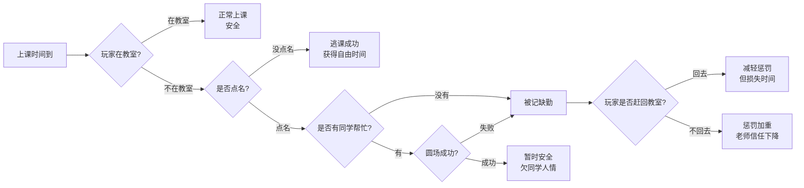

# 校园生活模拟器——属性、隐藏变量与结局设计（14天最终能量重制版）

> **历史草稿说明**：本文件保留为早期数值/变量策划稿，不再作为 AI 编程主规范。
>
> 当前请优先参考：
> - `plan/校园生活模拟器 AI 编程事件规范（主文档）.md`
> - `plan/校园生活模拟器 AI 编程事件规范（附录速查）.md`
>
> 本文件主要用于保留原始变量、事件链和结局设计思路；如与主规范或后续代码重构冲突，应以新的统一规范为准。

## 一、核心变量速查表

### 1. 五大基础属性 (范围：0~100，金钱为 0~999)

| **属性**       | **英文变量** | **说明**                                                     |
| -------------- | ------------ | ------------------------------------------------------------ |
| 金钱           | Gold         | 用于购买食物、道具、活动消费。                               |
| **能量(体力)** | **Energy**   | **核心消耗资源。任何日常行动都会消耗，需通过吃饭、睡觉、吃零食恢复。降至 0 会触发强制结局。** |
| 压力           | Stress       | 学习与生活压力，越低越好。                                   |
| 知识           | Academic     | 学业能力，决定学习收益与检定。                               |
| 社交           | Social       | 人际交往能力，决定事件选项判定。                             |

### 2. 核心状态隐藏变量：健康指数 (healthIndex)

**初始值：100**。衡量长期生活习惯的隐藏底线。

| **阶段界限** | **游戏内提示文案/效果**                                      |
| ------------ | ------------------------------------------------------------ |
| `> 60`       | **健康：** 无提示，身体状况良好。                            |
| `≤ 60`       | **亚健康警告：** “你最近总是感觉头晕乏力，也许该少熬点夜，或者去锻炼一下了。” *(隐藏效果：每日基础 Energy 恢复量减少)* |
| `≤ 30`       | **疾病预警：** “你的心脏时不时传来刺痛，呼吸也变得沉重。身体发出最后通牒！” *(隐藏效果：屏幕边缘红色暗角)* |
| `≤ 0`        | **强制结局：** 强制中断当前所有日程，立即触发【因病休学（医院结局）】。 |

- ### 3. 常规隐藏变量与状态标记

  **数值型隐藏变量 (Int)**

  *(注：在14天的流程中，除特别说明外，累积极值通常在 20~40 左右)*

  | **变量名**            | **类型** | **含义**     | **备注**                       |
  | --------------------- | -------- | ------------ | ------------------------------ |
  | `lateCount`           | Int      | 迟到次数     | 影响老师点名与相关副结局       |
  | `skipClassCount`      | Int      | 缺课次数     | 影响老师信任度与主结局判定     |
  | `teacherTrust`        | Int      | 老师信任度   |                                |
  | `classAttendCount`    | Int      | 到课次数     | 记录玩家按时/补救进入课堂的次数 |
  | `rollCallCount`       | Int      | 点名触发次数 | 用于课程点名链副结局判定       |
  | `rollCallSavedCount`  | Int      | 点名救场成功次数 | 包含同学圆场与赶回教室成功     |
  | `absencePenaltyCount` | Int      | 缺勤惩罚次数 | 被正式记缺勤或补救失败时增加   |
  | `returnClassCount`    | Int      | 赶回教室次数 | 影响“迟到补锅人/早八冲刺王”称号 |
  | `lateNightLevel`      | Int      | 熬夜程度     |                                |
  | `partTimeCount`       | Int      | 兼职次数     | 决定是否触发“打工皇帝”结局     |
  | `innovationProgress`  | Int      | 大创进度     | **极值上限设定为 100**         |
  | `innovationTeamTrust` | Int      | 大创团队信任 | 信任低更容易触发队友失联等事件 |
  | `friendBond`          | Int      | 同学羁绊     | 决定同学互助事件的触发         |
  | `friendHelpCount`     | Int      | 同学互助次数 | 帮助同学或被同学帮助时增加     |
  | `friendRefuseCount`   | Int      | 拒绝互助次数 | 影响“关系冷淡/已读不回的人”称号 |
  | `friendRollCallHelpCount` | Int  | 同学点名救场次数 | 记录同学在点名链中成功帮忙     |
  | `friendReviewCount`   | Int      | 考前互助复习次数 | 影响考前伙伴与资料共享者称号   |
  | `socialAwkwardCount`  | Int      | 社交尴尬次数 | 社死、公开出糗、回避沟通时增加 |
  | `storeTrust`          | Int      | 便利店排班信任 | 影响后续夜班兼职与便利店事件收益 |
  | `clubActivityCount`   | Int      | 社团参与次数 | 影响社团路线结算               |
  | `clubContribution`    | Int      | 社团贡献度   | 影响社团主心骨、展示担当等称号 |
  | `clubRelation`        | Int      | 社团关系值   | 影响社团分歧和展示结果         |
  | `clubShowcaseScore`   | Int      | 社团展示分   | 社团展示节点的最终表现         |
  | `innovationDefenseScore` | Int   | 大创答辩分   | 用于大创现场答辩与结果结算     |
  | `innovationCrisisCount`  | Int   | 大创危机次数 | 中期危机、Demo翻车、队友失联时增加 |
  | `libraryVisitCount` | Int   | 图书馆交互次数 | 影响“图书馆钉子户”称号         |
  | `storeNightShiftCount` | Int | 便利店夜班次数 | 影响“夜班战神”称号             |
  | `exerciseCount`       | Int      | 锻炼次数     |                                |
  | `mealCount`           | Int      | 正常吃饭次数 |                                |
  | `gameAddiction`       | Int      | 游戏沉迷值   |                                |

  **布尔型状态标记 (Boolean)**

  *(注：用于记录特定事件是否发生或状态是否解锁，通常只有 true/false 两种状态)*

  | **变量名**            | **类型** | **含义**                               |
  | --------------------- | -------- | -------------------------------------- |
  | `sharedNotes`         | Boolean  | 是否拥有同学分享的复习笔记             |
  | `innovationJoined`    | Boolean  | 是否已报名参加大创比赛                 |
  | `innovationLeader`    | Boolean  | 是否在队伍中担任大创负责人             |
  | `innovationDemoReady` | Boolean  | 是否已备好可展示 Demo；仅用于兼容旧判定，新逻辑优先使用 `innovationDemoMode` |
  | `innovationIntel`     | Boolean  | 是否提前打听过大创队友/题目经验        |
  | `clubShowcaseSuccess` | Boolean  | 社团展示是否成功                       |
  | `researchUnlocked`    | Boolean  | 是否解锁 Research，影响大创资料与答辩问答 |
  | `expressionUnlocked`  | Boolean  | 是否解锁 Expression，影响社交表达与答辩展示 |
  | `logicUnlocked`       | Boolean  | 是否解锁 Logic，影响技术、考试与修理判定 |
  | `campusIntelUnlocked` | Boolean  | 是否解锁 Campus Intel，影响校园事件额外选项 |
  | `owedFavor`           | Boolean  | 是否欠下同学人情（需后续触发事件偿还） |

  **枚举/字符串型状态标记 (Enum/String)**

  | **变量名** | **可选值** | **含义** |
  | ---------- | ---------- | -------- |
  | `clubType` | `"none"` / `"academic"` / `"sports"` / `"arts"` | 当前加入的社团类型，初始为 `"none"` |
  | `innovationTopic` | `"none"` / `"morning_helper"` / `"cafeteria_predict"` / `"san_helper"` / `"undecided"` | 大创选题方向，初始为 `"none"` |
  | `innovationDemoMode` | `"none"` / `"live"` / `"video"` / `"safe"` | 大创答辩展示方式，初始为 `"none"` |
  | `innovationSpeaker` | `"none"` / `"player"` / `"teammate"` | 大创答辩主讲人，初始为 `"none"` |
  | `innovationResult` | `"none"` / `"excellent"` / `"firefighter"` / `"completed"` / `"pass"` / `"failed"` / `"bystander"` | 大创路线结算结果，初始为 `"none"` |

  **逻辑换算说明**

  | **文件一表述** | **文件二采用的判定** |
  | -------------- | -------------------- |
  | SAN 较高/临场稳定 | `Stress ≤ 50` |
  | SAN 较低/心态崩溃 | `Stress ≥ 70` |
  | Expression | `expressionUnlocked = true` 或 `Social ≥ 60` |
  | Logic | `logicUnlocked = true` 或 `Academic ≥ 60` |
  | Research | `researchUnlocked = true` 或 `Academic ≥ 60` |
  | Campus Intel | `campusIntelUnlocked = true` |

  **流程判定与数值边界**

  | **规则** | **处理方式** |
  | -------- | ------------ |
  | 基础属性越界 | `Energy`、`Stress`、`Academic`、`Social` 结算后统一限制在 0~100 |
  | 金钱越界 | `Gold` 结算后统一限制在 0~999；若支付选项会导致 Gold < 0，则该选项不可选 |
  | 隐藏计数越界 | 次数型隐藏变量最低为 0；`innovationProgress` 限制在 0~100 |
  | 行动结算顺序 | 先检查选项门槛，再结算属性变化，再限制数值范围，最后检查强制结局与任务链结果 |
  | Energy 不足 | 有 Energy 门槛的选项不可选；无门槛行动若结算后 `Energy ≤ 0`，立即触发【崩溃退学】 |
  | Stress 爆表 | 任意行动结算后若 `Stress ≥ 100`，立即触发【崩溃退学】 |
  | 健康归零 | 任意行动结算后若 `healthIndex ≤ 0`，优先触发【因病休学】 |
  | 点名事件重复计数 | 课程点名链与同学互助链共用同一次点名；同一事件只允许 `rollCallCount +1` |
  | 大创未报名 | `innovationJoined = false` 时，大创常规交互不增加 `innovationProgress` |
  | 欠人情未偿还 | 第14天若 `owedFavor = true` 且 `friendBond < 4`，额外 `friendRefuseCount +1` |
  | 便利店信誉过低 | 若 `storeTrust ≤ -5`，后续便利店夜班兼职不可触发，直到通过正向便利店事件把 storeTrust 修复到 -2 以上 |

## 二、场景事件大全（按地点拆分）

### 1. 【食堂】场景

**常规交互**

| **交互动作** | **基础属性变化**                    | **隐藏变量变化**             | **备注**       |
| ------------ | ----------------------------------- | ---------------------------- | -------------- |
| 打饭与吃饭   | Gold -15, **Energy +20**, Stress -5 | mealCount +1, healthIndex +3 | 核心回体力手段 |

**突发事件：最后一份鸡腿**

| **玩家选项**     | **属性门槛条件** | **基础属性变化**                 | **隐藏变量变化** |
| ---------------- | ---------------- | -------------------------------- | ---------------- |
| 迅速下单拿下     | Energy ≥ 50      | Energy +10, Stress -5            | -                |
| 礼貌协商一人一半 | Social ≥ 40      | Energy +5, Social +5             | friendBond +1    |
| 加钱换豪华套餐   | Gold ≥ 30        | Gold -30, Energy +15, Stress -10 | -                |
| 默默选择青菜     | 无               | Energy +2, Stress +2             | -                |

### 2. 【宿舍】场景

**常规交互**

| **交互动作** | **基础属性变化**                       | **隐藏变量变化**                                    | **备注**                                   |
| ------------ | -------------------------------------- | --------------------------------------------------- | ------------------------------------------ |
| 睡觉         | **Energy +40**, Stress -15             | lateNightLevel -10, healthIndex +3                  | 大幅恢复体力                               |
| 午休/短休    | **Energy +15**, Stress -5              | -                                                   | -                                          |
| 刷手机       | **Energy -3**, Stress -8               | lateNightLevel +2                                   | 消耗极少体力打发时间                       |
| 宿舍学习     | Academic +8, Stress +5, **Energy -10** | -                                                   | 脑力消耗大                                 |
| 打游戏       | Academic -2, Stress -12, **Energy -5** | gameAddiction +5, lateNightLevel +3, healthIndex -2 | 连打3次惩罚: Academic -10, teacherTrust -5 |
| 熬夜         | Stress +15, **Energy -20**             | lateNightLevel +5, healthIndex -10                  | 连续3次惩罚: 强制触发医院结局              |

**突发事件：宿舍断网**

| **玩家选项** | **属性门槛条件** | **基础属性变化**                      | **隐藏变量变化** |
| ------------ | ---------------- | ------------------------------------- | ---------------- |
| 尝试修路由器 | Academic ≥ 40    | Academic +5, Stress -5, **Energy -5** | -                |
| 组织线下聊天 | Social ≥ 40      | Social +8, Stress -10, **Energy -2**  | friendBond +1    |
| 趁机离线学习 | Stress ≤ 50      | Academic +10, **Energy -8**           | -                |
| 崩溃刷新网络 | 无               | **Energy -3**, Stress +10             | -                |

**突发事件：社死朋友圈误发**

| **玩家选项** | **属性门槛条件** | **基础属性变化** | **隐藏变量变化** |
| ------------ | ---------------- | ---------------- | ---------------- |
| 立刻删除并装死 | Stress ≤ 50 | Stress +3, **Energy -2** | socialAwkwardCount +1 |
| 用玩笑圆回来 | Social ≥ 50 或 expressionUnlocked = true | Social +5, Stress -5, **Energy -3** | friendBond +1 |
| 私聊相关同学解释 | Social ≥ 40 且 Stress ≤ 60 | Social +3, Stress -8, **Energy -5** | friendBond +1 |
| 假装没看见 | 无 | Stress +15 | socialAwkwardCount +2, friendBond -1 |

### 3. 【教室】场景

**常规交互**

| **交互动作**   | **基础属性变化**                      | **隐藏变量变化**                   | **备注**           |
| -------------- | ------------------------------------- | ---------------------------------- | ------------------ |
| 正常上课       | Academic +10, **Energy -10**          | classAttendCount +1, teacherTrust +2 | 听课消耗体力       |
| 缺课           | -                                     | skipClassCount +1, absencePenaltyCount +1, teacherTrust -5 | 不在教室时自动触发 |
| 复习笔记       | Academic +5, Stress -2, **Energy -5** | -                                  | 课后触发           |
| 看黑板残留内容 | Academic +3, **Energy -2**            | teacherTrust +1                    | 课前/课后皆可      |

**突发事件：老师突然点名 (玩家不在教室时触发)**

| **玩家选项** | **属性门槛条件**              | **基础属性变化**          | **隐藏变量变化**                   |
| ------------ | ----------------------------- | ------------------------- | ---------------------------------- |
| 请同学圆场   | Social ≥ 40 或 friendBond > 0 | Stress +5                 | rollCallCount +1, rollCallSavedCount +1, owedFavor = true (成功免缺课) |
| 立刻赶回教室 | Energy ≥ 40                   | **Energy -15**, Stress +5 | rollCallCount +1, lateCount +1, returnClassCount +1, rollCallSavedCount +1, classAttendCount +1, teacherTrust +2 |
| 假装不知道   | 无                            | Stress +2                 | rollCallCount +1, skipClassCount +1, absencePenaltyCount +1, teacherTrust -5 |

**突发事件：老师让上台写题 (玩家在教室时触发)**

| **玩家选项** | **属性门槛条件** | **基础属性变化**                      | **隐藏变量变化** |
| ------------ | ---------------- | ------------------------------------- | ---------------- |
| 自信上台解题 | Academic ≥ 60    | Academic +5, Stress -5, **Energy -5** | teacherTrust +5  |
| 边写边现编   | Stress ≤ 50      | **Energy -8**, Stress +15             | teacherTrust -2  |
| 请求同学提示 | Social ≥ 50      | Social +2, **Energy -2**              | owedFavor = true |
| 说自己不会   | 无               | Stress +8                             | teacherTrust -5  |

### 4. 【图书馆】场景

**常规交互**

| **交互动作**   | **基础属性变化**                        | **隐藏变量变化** |
| -------------- | --------------------------------------- | ---------------- |
| 阅读理工书     | Academic +15, Stress +2, **Energy -12** | libraryVisitCount +1, logicUnlocked = true |
| 阅读文学书     | Stress -10, Social +3, **Energy -6**    | libraryVisitCount +1, expressionUnlocked = true |
| 查阅参考资料   | Academic +8, Stress -3, **Energy -8**   | libraryVisitCount +1, researchUnlocked = true |
| 阅读校史杂谈   | Academic +3, Social +2, **Energy -6**   | libraryVisitCount +1, campusIntelUnlocked = true |
| 图书管理员兼职 | Gold +20, **Energy -15**, Stress +2     | libraryVisitCount +1, partTimeCount +1 |

**突发事件：座位争夺战**

| **玩家选项** | **属性门槛条件** | **基础属性变化**                                | **隐藏变量变化** |
| ------------ | ---------------- | ----------------------------------------------- | ---------------- |
| 快步抢先坐下 | Energy ≥ 40      | Academic +5, Stress +2, **Energy -5**, Social -5 | -                |
| 礼貌询问拼桌 | Social ≥ 40      | Academic +5, Social +5, **Energy -2**           | friendBond +1    |
| 去冷门角落   | Academic ≥ 30    | Academic +8, **Energy -5**                      | -                |
| 放弃回宿舍   | 无               | Stress +5                                       | -                |

### 5. 【健身房】场景

**常规交互**

| **交互动作** | **基础属性变化**          | **隐藏变量变化**                 |
| ------------ | ------------------------- | -------------------------------- |
| 跑步机       | **Energy -10**, Stress -8 | exerciseCount +1, healthIndex +5 |
| 力量训练     | **Energy -15**, Stress -2 | exerciseCount +1, healthIndex +5 |
| 前台兼职     | Gold +30, **Energy -12**  | partTimeCount +1                 |

**突发事件：器械被占**

| **玩家选项**     | **属性门槛条件** | **基础属性变化**            | **隐藏变量变化** |
| ---------------- | ---------------- | --------------------------- | ---------------- |
| 礼貌询问还要多久 | Social ≥ 40      | **Energy -2**, Social +3    | -                |
| 换一组训练计划   | Academic ≥ 30    | **Energy -10**, Academic +2 | -                |
| 硬等             | 无               | Stress +5, **Energy -3**    | -                |
| 直接离开         | 无               | Stress +2                   | -                |

### 6. 【便利店】场景

**常规交互**

| **交互动作**  | **基础属性变化**                     | **隐藏变量变化**                                    |
| ------------- | ------------------------------------ | --------------------------------------------------- |
| 买饮料 (提神) | Gold -8, **Energy +10**, Stress -3   | healthIndex -5                                      |
| 买快捷食物    | Gold -12, **Energy +15**             | healthIndex -3                                      |
| 泡面 (深夜)   | Gold -10, **Energy +10**, Stress -10 | healthIndex -5 (回体力但伤身)                       |
| 收银兼职      | Gold +40, **Energy -20**, Stress +5  | partTimeCount +1, storeNightShiftCount +1, lateNightLevel +5, healthIndex -2 |

**突发事件：便利店遇到老师**

| **玩家选项** | **属性门槛条件** | **基础属性变化** | **隐藏变量变化** |
| ------------ | ---------------- | ---------------- | ---------------- |
| 大方打招呼 | Social ≥ 40 且 Stress ≤ 60 | Social +3, Stress -3 | teacherTrust +2 |
| 假装普通顾客或店员 | Stress ≤ 50 | Stress +3 | - |
| 趁机问学习问题 | Academic ≥ 40 且 Social ≥ 40 | Academic +5, Social +2, Stress -2 | teacherTrust +3 |
| 躲到货架后 | 无 | Stress +8 | teacherTrust -2, socialAwkwardCount +1 |

**突发事件：临时加班 (夜班兼职时概率触发)**

| **玩家选项** | **属性门槛条件** | **基础属性变化**                              | **隐藏变量变化**                                    |
| ------------ | ---------------- | --------------------------------------------- | --------------------------------------------------- |
| 接受加班     | Energy ≥ 40      | Gold +50, **Energy -25**, Stress +8           | partTimeCount +1, storeNightShiftCount +1, lateNightLevel +3, healthIndex -2, storeTrust +1 |
| 婉拒         | Social ≥ 40      | Stress -2, Social -1                          | storeTrust -1                                       |
| 讨价还价     | Social ≥ 60      | Gold +80, **Energy -25**, Stress +10, Social -5 | partTimeCount +1, storeNightShiftCount +1, healthIndex -3, storeTrust -1 |
| 直接溜走     | 无               | Stress -5, Social -5                          | storeTrust -5，后续排班概率降低                    |

**突发事件：便利店夜宵售罄**

| **玩家选项** | **属性门槛条件** | **基础属性变化** | **隐藏变量变化** |
| ------------ | ---------------- | ---------------- | ---------------- |
| 买剩下的临期面包 | Gold ≥ 8 | Gold -8, **Energy +8**, Stress -2 | healthIndex -4 |
| 泡一桶方便面 | 无 | Gold -10, **Energy +10**, Stress -8 | healthIndex -5, lateNightLevel +1 |
| 去食堂碰碰运气 | Energy ≥ 35 | **Energy -8**, Stress +3 | 食堂开放：可再触发“打饭与吃饭”；食堂关闭：Stress +5 |
| 放弃夜宵 | Stress ≤ 50 | Stress +5, **Energy +5** | healthIndex +1 |

**突发事件：便利店顾客投诉**

| **玩家选项** | **属性门槛条件** | **基础属性变化** | **隐藏变量变化** |
| ------------ | ---------------- | ---------------- | ---------------- |
| 冷静核对小票 | Academic ≥ 40 或 logicUnlocked = true | Academic +2, Stress +5, **Energy -5** | storeTrust +2 |
| 礼貌安抚顾客 | Social ≥ 40 | Social +3, Stress +3, **Energy -3** | storeTrust +2 |
| 直接赔差价 | Gold ≥ 20 | Gold -20, Stress -2 | storeTrust +1 |
| 慌乱处理 | 无 | Stress +12, **Energy -5** | storeTrust -3, socialAwkwardCount +1 |

### 7. 【校园/其他】全局交互

| **交互动作**  | **基础属性变化**                                | **隐藏变量变化**                                         | **备注** |
| ------------- | ----------------------------------------------- | -------------------------------------------------------- | -------- |
| 推进大创方案  | Academic +5, Stress +5, **Energy -10**, Social +5 | innovationJoined = true 时 innovationProgress +5；否则不增加大创进度 | 随处皆可 |
| 熬夜做大创PPT | **Energy -20**, Stress +8, Social +3              | innovationJoined = true 时 innovationProgress +8；lateNightLevel +5, healthIndex -3 | -        |
| 大创团队会议  | Social +5, Stress +3, **Energy -8**              | innovationJoined = true 时 innovationTeamTrust +5, innovationProgress +5 | 图书馆/教室触发 |

**突发事件：校园路演拉上台**

| **玩家选项**   | **属性门槛条件** | **基础属性变化**                     | **隐藏变量变化** |
| -------------- | ---------------- | ------------------------------------ | ---------------- |
| 大方上台互动   | Social ≥ 50      | Social +10, Stress -5, **Energy -5** | -                |
| 用幽默化解尴尬 | Social ≥ 60      | Social +15, **Energy -5**            | -                |
| 找借口快速离开 | Energy ≥ 40      | **Energy -10**, Stress +2            | -                |
| 尴尬站住       | 无               | Stress +10, **Energy -2**            | -                |

## 三、长任务链（连续事件网）

### 1. 课程与点名链

该链条用于补齐“上课时间到”后的完整课堂流程。它不是单次教室事件，而是贯穿 14 天的长期行为统计，会持续影响老师信任、缺勤惩罚、同学人情与课程点名组副结局。

#### 1.1 链条逻辑



#### 1.2 自动节点与结果

| **节点** | **触发条件** | **基础属性变化** | **隐藏变量与其他影响** | **提示文本** |
| -------- | ------------ | ---------------- | ---------------------- | ------------ |
| 正常上课 | 上课时间到，玩家在教室 | Academic +10, **Energy -10** | classAttendCount +1, teacherTrust +2 | 你坐在教室里，老师点名时你正常答到。这节课至少没有出事故。 |
| 逃课成功 | 玩家不在教室，且本节课未点名 | Stress -5 | skipClassCount +1, teacherTrust -2 | 老师今天没有点名。你获得了一段自由时间，但缺课记录悄悄增加了。 |
| 同学圆场成功 | 被点名且不在教室，同学帮忙判定成功 | Stress +5 | rollCallCount +1, rollCallSavedCount +1, owedFavor = true | 同学帮你应付了点名。你躲过一劫，但这份人情以后要还。 |
| 同学圆场失败 | 被点名且不在教室，同学帮忙判定失败 | Stress +8 | rollCallCount +1, teacherTrust -2，进入“被记缺勤后”补救节点 | 同学没能帮你圆过去。老师停顿了一下，在名单上做了标记。 |
| 被记缺勤 | 被点名且不在教室，无同学帮忙 | Stress +8 | rollCallCount +1, teacherTrust -2，进入“被记缺勤后”补救节点 | 你不在教室，也没人能替你解释。逃课的代价落到了你头上。 |

#### 1.3 玩家选择节点

| **触发节点** | **玩家选项** | **属性门槛条件** | **基础属性变化** | **隐藏变量与其他影响** |
| ------------ | ------------ | ---------------- | ---------------- | ---------------------- |
| 被点名且不在教室 | 请同学圆场 | Social ≥ 40 或 friendBond > 0 | Stress +5 | 成功：rollCallSavedCount +1, owedFavor = true；失败：进入“被记缺勤后”补救节点 |
| 被记缺勤后 | 立刻赶回教室 | Energy ≥ 40 | **Energy -15**, Stress +5 | lateCount +1, returnClassCount +1, rollCallSavedCount +1, classAttendCount +1, teacherTrust +2 |
| 被记缺勤后 | 不回教室 | 无 | Stress +2 | skipClassCount +1, absencePenaltyCount +1, teacherTrust -5 |

说明：

- 玩家在教室时，不需要弹出选择，只结算“正常上课”。
- 玩家不在教室但本节课没有点名时，也不需要弹出选择，只提示“逃课成功”。
- 只有被点名、出事、需要补救时才弹出选择。
- “请同学圆场”与同学互助链联动：friendBond 越高，圆场成功率越高；若 owedFavor 已为 true，后续更容易触发偿还人情事件。

#### 1.4 课程与点名链副结局

课程与点名链的副结局不代表考试最终成绩，而是总结玩家这一学期对“上课/逃课/补救”的态度。

| **副结局 ID** | **副结局** | **称号** | **可能条件** | **结算文本** |
| ------------- | ---------- | -------- | ------------ | ------------ |
| `class_stable_student` | 稳定上课 | 课堂稳定器 | classAttendCount ≥ 8 且 skipClassCount ≤ 1 且 teacherTrust ≥ 20 | 你大多数时候都坐在教室里。它不传奇，但足够稳定，也足够让老师记住你是个靠谱的人。 |
| `class_roll_call_survivor` | 点名幸存 | 点名边缘人 | skipClassCount ≥ 2 且 rollCallSavedCount ≥ 2 | 你不是没逃过课，只是每次危险都差一点擦肩而过。点名册上有你的传说，也有你的冷汗。 |
| `class_morning_runner` | 冲刺救场 | 早八冲刺王 | returnClassCount ≥ 3 且 lateCount ≥ 3 | 你用脚步声证明了自己还想上课。老师可能不完全满意，但至少看见了你冲进教室的残影。 |
| `class_absence_warning` | 缺勤预警 | 缺勤边缘户 | skipClassCount ≥ 5 且 absencePenaltyCount ≥ 3 且 teacherTrust ≤ 10 | 你获得了很多自由时间，也把自己推到了危险边缘。老师的点名册成了你本学期最大的敌人。 |
| `class_honest_repair` | 诚实补救 | 迟到补锅人 | 被点名后经常选择“立刻赶回教室”或主动解释，returnClassCount ≥ 2 | 你犯过错，但也愿意补救。这个学期没有完美答案，只有一次次赶回去的选择。 |

### 2. 同学互助链

这条链用于让玩家感到“人际关系会在关键时刻救你，或者反过来拖住你”。它不需要新场景，可以自然分布在教室、图书馆、食堂和宿舍。

核心玩法：

```text
第一次帮不帮同学 -> 对方是否信任你 -> 之后点名/复习/大创时能不能互相救场
```

#### 2.1 链条阶段

| **阶段** | **事件 ID** | **事件名** | **触发建议** |
| -------- | ----------- | ---------- | ------------ |
| 1 | `friend_help_start` | 同学卡题求助 | Day 2-4，图书馆/教室 |
| 2 | `friend_lunch_return` | 食堂回礼 | 帮助过同学后，食堂触发 |
| 3 | `friend_roll_call_help` | 点名救场 | 玩家逃课被点名时可触发 |
| 4 | `friend_exam_review` | 考前互助复习 | 期中/期末前 |
| 5 | `friend_result` | 关系结果 | 第14天结算时 |

#### 2.2 阶段 1：同学卡题求助

| **字段** | **内容** |
| -------- | -------- |
| 事件 ID | `friend_help_start` |
| 事件名 | 同学卡题求助 |
| 事件描述 | 你在图书馆或教室复习时，一个同学拿着题目凑过来：“这题你会吗？我卡半天了。”你自己的计划也很满，但他看起来真的需要帮助。 |

| **选项** | **属性门槛条件** | **基础属性变化** | **隐藏变量与其他影响** | **结果反馈** |
| -------- | ---------------- | ---------------- | ---------------------- | ------------ |
| 耐心讲到他听懂 | Academic ≥ 50 且 Energy ≥ 30 | Academic +2, Social +5, **Energy -8** | friendBond +2, friendHelpCount +1, owedFavor = false | 你花了不少时间把思路讲清楚。对方明显松了一口气，也认真记住了你这次帮忙。 |
| 给关键提示，让他自己想 | Academic ≥ 30 | Academic +1, Social +3, **Energy -3** | friendBond +1, friendHelpCount +1 | 你没有直接给答案，而是点出关键思路。对方想了一会儿，终于有点明白了。 |
| 推荐他去问老师 | Social ≥ 30 | teacherTrust +1 | friendBond 不变 | 你没有硬讲，而是建议他去问老师。这个做法稳妥，但关系没有明显拉近。 |
| 说自己也很忙 | 无 | Stress -2 | friendBond -1, friendRefuseCount +1 | 你婉拒了他。对方点点头离开，气氛有一点尴尬。 |

#### 2.3 阶段 2：食堂回礼

| **字段** | **内容** |
| -------- | -------- |
| 事件 ID | `friend_lunch_return` |
| 事件名 | 食堂回礼 |
| 事件描述 | 午饭时，之前被你帮过的同学端着餐盘坐到你旁边，说上次那题终于弄懂了，想请你喝饮料。 |

| **选项** | **属性门槛条件** | **基础属性变化** | **隐藏变量与其他影响** | **结果反馈** |
| -------- | ---------------- | ---------------- | ---------------------- | ------------ |
| 接受回礼，顺便聊天 | Social ≥ 30 | Social +2, Stress -3, **Energy +5** | friendBond +1 | 你们边吃边聊，关系自然熟了一点。 |
| 不收饮料，但继续聊 | Stress ≤ 60 或 Social ≥ 40 | Social +1, Stress -2 | friendBond +1, owedFavor = true | 你没有收他的东西，但对方更觉得你靠谱。 |
| 只简单回应 | 无 | - | 关系保持 | 你礼貌回应了几句，然后继续吃饭。关系没有变差，也没有更近。 |
| 开玩笑说以后帮你点名 | Social ≥ 40 | Social +2, Academic -1 | friendBond +1，后续点名救场更容易出现 | 对方笑着说“行啊，到时候看我发挥”。这句话也许真的会派上用场。 |

#### 2.4 阶段 3：点名救场

| **字段** | **内容** |
| -------- | -------- |
| 事件 ID | `friend_roll_call_help` |
| 事件名 | 点名救场 |
| 事件描述 | 你逃课时，老师突然点名。手机震了一下，是那个同学发来的消息：“老师点到你了，要不要我帮你圆一下？” |

| **选项** | **属性门槛条件** | **基础属性变化** | **隐藏变量与其他影响** | **结果反馈** |
| -------- | ---------------- | ---------------- | ---------------------- | ------------ |
| 拜托他帮忙圆场 | friendBond ≥ 2 或 Social ≥ 40 | Stress +5 | 成功：rollCallSavedCount +1, friendRollCallHelpCount +1, owedFavor = true；失败：absencePenaltyCount +1, teacherTrust -5 | 他帮你应付了过去。你躲过一劫，但这份人情以后肯定要还。 |
| 立刻赶回教室 | Energy ≥ 40 | **Energy -15**, Stress +5 | lateCount +1, returnClassCount +1, rollCallSavedCount +1, classAttendCount +1, teacherTrust +2 | 你没有让他冒险，而是自己冲回教室。虽然狼狈，但还算体面。 |
| 让他别管 | Stress ≤ 70 | Stress +8 | skipClassCount +1, absencePenaltyCount +1, friendBond +1 | 你不想把他拖下水。结果不太好，但对方记住了你的分寸。 |
| 已读不回 | 无 | Stress +2 | skipClassCount +1, absencePenaltyCount +1, friendBond -1, friendRefuseCount +1 | 你没有回应。老师记了你缺勤，同学也不知道你到底怎么想。 |

#### 2.5 阶段 4：考前互助复习

| **字段** | **内容** |
| -------- | -------- |
| 事件 ID | `friend_exam_review` |
| 事件名 | 考前互助复习 |
| 事件描述 | 考试前一晚，你收到同学发来的复习资料。他说：“之前你帮过我，这次我整理了一份重点，要不要一起过一遍？” |

| **选项** | **属性门槛条件** | **基础属性变化** | **隐藏变量与其他影响** | **结果反馈** |
| -------- | ---------------- | ---------------- | ---------------------- | ------------ |
| 一起复习重点 | Academic ≥ 40 或 Social ≥ 40 | Academic +10, Stress -5, **Energy -10** | sharedNotes = true, friendReviewCount +1, friendHelpCount +1 | 你们把重点过了一遍。很多零散知识终于串起来了。 |
| 让他讲你不会的部分 | Social ≥ 40 | Academic +8, Social +5, **Energy -8** | friendBond +1, friendReviewCount +1 | 他把几个难点讲得很细，你突然理解了之前一直卡住的内容。 |
| 把自己的笔记也分享给他 | Academic ≥ 50 | Academic +5, Social +3, **Energy -5** | sharedNotes = true, friendBond +1, friendReviewCount +1 | 你们交换了笔记，像临时组成了一个考前互助小组。 |
| 拒绝，自己复习 | 无 | Academic +5, **Energy -5** | friendRefuseCount +1 | 你决定按自己的节奏复习。安静是安静，但少了一份帮助。 |

#### 2.6 阶段 5：关系结果

| **关系结果** | **可能条件** | **反馈文本** |
| ------------ | ------------ | ------------ |
| 可靠搭档 | friendBond ≥ 6 且 friendHelpCount ≥ 3 | 这个学期里，你们不只是普通同学。你帮过他，他也在关键时候拉过你一把。 |
| 点名战友 | friendRollCallHelpCount ≥ 1 且 friendHelpCount < 3 | 你们的关系有点微妙，但有一件事很确定：他真的帮你躲过一次大麻烦。 |
| 考前伙伴 | sharedNotes = true 且 friendReviewCount ≥ 1 | 你们靠互相分享资料撑过了考试。成绩也许不是奇迹，但至少不是孤军奋战。 |
| 普通同学 | friendBond 在 0~2 且 friendHelpCount ≤ 1 | 你们认识，但没有真正走近。校园里很多关系都是这样停在点头之交。 |
| 关系冷淡 | friendRefuseCount ≥ 2 或 friendBond < 0 | 对方后来很少再找你。你们没有吵架，只是自然地疏远了。 |

#### 2.7 前后影响示例

| **前面选择** | **后面影响** |
| ------------ | ------------ |
| 耐心讲题 | 后续食堂回礼、点名救场、考前资料更容易出现 |
| 婉拒求助 | 后续对方不太可能帮你圆场 |
| 食堂开玩笑说帮点名 | 点名救场节点更容易触发 |
| 让同学帮你圆场 | 避免缺勤，但欠下人情 |
| 不让同学冒险 | 可能被记缺勤，但关系反而更稳 |
| 共享笔记 | 期中/期末考试获得加成 |

#### 2.8 同学互助链副结局称号

同学互助链的副结局重点不是“数值收益”，而是让玩家感觉自己在校园里留下了一段关系。

| **副结局 ID** | **副结局** | **称号** | **可能条件** | **结算文本** |
| ------------- | ---------- | -------- | ------------ | ------------ |
| `friend_reliable_partner` | 可靠搭档 | 靠谱同桌 | friendBond ≥ 6 且 friendHelpCount ≥ 3 | 这个学期里，你们不只是普通同学。你帮过他，他也在关键时候拉过你一把。 |
| `friend_roll_call_buddy` | 点名战友 | 点名互保人 | friendRollCallHelpCount ≥ 1 | 你们的关系有点微妙，但有一件事很确定：点名发生时，他真的帮你挡过一次风。 |
| `friend_exam_ally` | 考前伙伴 | 资料共享者 | sharedNotes = true 且 friendReviewCount ≥ 1 | 你们靠互相分享资料撑过了考试。成绩也许不是奇迹，但至少不是孤军奋战。 |
| `friend_nodding_terms` | 普通同学 | 点头之交 | friendBond 在 0~2 且 friendHelpCount ≤ 1 | 你们认识，但没有真正走近。校园里很多关系都是这样，停在见面点头的距离。 |
| `friend_read_ignored` | 关系冷淡 | 已读不回的人 | friendRefuseCount ≥ 2 或 friendBond < 0 | 对方后来很少再找你。你们没有吵架，只是自然地疏远了。 |

### 3. 社团活动链

| **触发节点** | **玩家选项** | **属性门槛条件** | **基础属性变化** | **隐藏变量与其他影响** |
| ------------ | ------------ | ---------------- | ---------------- | ---------------------- |
| **阶段 1：社团招新** | 加入学术类社团 | Academic ≥ 30 | Academic +5, **Energy -5** | clubType = "academic", clubActivityCount +1, clubRelation +1 |
| | 加入体育类社团 | Energy ≥ 35 | Stress -5, **Energy -10** | clubType = "sports", clubActivityCount +1, healthIndex +2 |
| | 加入文艺类社团 | Social ≥ 30 | Social +5, **Energy -5** | clubType = "arts", clubActivityCount +1, clubRelation +1 |
| | 暂时不加入 | 无 | Stress -3 | clubType = "none" |
| **阶段 2：第一次社团任务** | 主动承担核心任务 | clubType != "none" 且 Energy ≥ 35 | Academic +3, Social +3, Stress +5, **Energy -10** | clubActivityCount +1, clubContribution +3, clubRelation +1 |
| | 只完成自己的部分 | clubType != "none" | **Energy -5** | clubActivityCount +1, clubContribution +1 |
| | 找同学一起做 | clubType != "none" 且 Social ≥ 40 | Social +5, **Energy -6** | clubActivityCount +1, clubContribution +2, clubRelation +2, friendBond +1 |
| | 临时缺席 | clubType != "none" | Stress -5 | clubRelation -2, clubContribution -1 |
| **阶段 3：社团分歧** | 推动高目标方案 | Academic ≥ 45 或 Stress ≤ 50 | Academic +5, Stress +10, **Energy -10** | clubContribution +3, clubRelation -1 |
| | 协调折中方案 | Social ≥ 45 | Social +8, **Energy -5** | clubRelation +3, clubContribution +1, friendBond +2 |
| | 只做自己的部分 | 无 | **Energy -3** | clubContribution +1 |
| | 退出核心任务 | 无 | Stress -15, Social -5 | clubRelation -3, clubContribution -2 |
| **阶段 4：社团展示** | 上台展示成果 | Social ≥ 50 或 expressionUnlocked = true | Social +8, Stress -5, **Energy -8** | clubShowcaseScore +20, clubContribution +2, clubShowcaseSuccess = true |
| | 用专业内容撑场 | Academic ≥ 50 或 logicUnlocked = true | Academic +8, Stress +3, **Energy -8** | clubShowcaseScore +18, clubContribution +2 |
| | 帮忙做幕后统筹 | Energy ≥ 40 | Social +3, **Energy -10** | clubShowcaseScore +10, clubRelation +2 |
| | 低调划水 | 无 | Stress -5 | clubShowcaseScore -5, clubContribution -1 |

### 4. 大创比赛链 (高压路线)

| **触发节点** | **玩家选项** | **属性门槛条件** | **基础属性变化** | **隐藏变量与其他影响** |
| ------------ | ------------ | ---------------- | ---------------- | ---------------------- |
| **阶段 1：大创比赛通知** | 报名参加 | 无 | Stress +5, **Energy -2** | innovationJoined = true |
| | 先去打听队友和题目 | Social ≥ 40 或 campusIntelUnlocked = true | Social +2, **Energy -5** | innovationIntel = true, innovationTeamTrust +5 |
| | 直接放弃 | 无 | Stress -5 | innovationJoined = false, innovationResult = "bystander" |
| **阶段 2：组队与选题** | 自己当负责人，做“早八救星”应用 | Academic ≥ 45 且 Social ≥ 35 | Stress +15, **Energy -10** | innovationLeader = true, innovationTopic = "morning_helper", innovationProgress +15, innovationTeamTrust +5 |
| | 加入成熟队伍，做“食堂拥挤预测” | Social ≥ 40 | Social +5, **Energy -5** | innovationLeader = false, innovationTopic = "cafeteria_predict", innovationTeamTrust +15, innovationProgress +5 |
| | 找熟人凑队，做“心理状态小助手” | Social ≥ 35 或 Stress ≤ 50 | Stress -5, **Energy -5** | innovationTopic = "san_helper", innovationTeamTrust +5, innovationProgress +5 |
| | 随便凑队，题目之后再说 | 无 | Stress -2 | innovationTopic = "undecided", innovationTeamTrust -10, innovationProgress -5 |
| **阶段 3：中期危机** | 熬夜把核心内容补出来 | Academic ≥ 50 且 Energy ≥ 40 | Academic +10, Stress +15, **Energy -25** | innovationProgress +25, lateNightLevel +5, healthIndex -5, innovationCrisisCount +1 |
| | 召开紧急语音会议重新分工 | Social ≥ 45 | Social +5, Stress +8, **Energy -15** | innovationTeamTrust +12, innovationProgress +12 |
| | 主动找指导老师求救 | Social ≥ 40 且 Stress ≤ 70 | Stress +5, **Energy -8** | teacherTrust +5, innovationProgress +10, innovationDefenseScore +5 |
| | 用漂亮 PPT 包装现有进度 | Academic ≥ 40 或 expressionUnlocked = true | Academic +3, Stress +6, **Energy -10** | innovationProgress +8, innovationDefenseScore +3, innovationCrisisCount +1 |
| | 先摆烂睡觉 | 无 | **Energy +15**, Stress -10 | innovationProgress -20, innovationTeamTrust -5, innovationCrisisCount +1 |
| **阶段 4：答辩前夜** | 冒险打磨现场 Demo | Academic ≥ 55 且 Energy ≥ 45 | Stress +12, **Energy -30** | innovationDemoReady = true, innovationDemoMode = "live", innovationProgress +15, lateNightLevel +10, healthIndex -5 |
| | 录制演示视频，保证稳定 | Academic ≥ 40 | Stress +5, **Energy -15** | innovationDemoReady = true, innovationDemoMode = "video", innovationDefenseScore +8 |
| | 让表达最强的队友主讲 | Social ≥ 50 或 expressionUnlocked = true | Social +3, **Energy -8** | innovationSpeaker = "teammate", innovationTeamTrust +10 |
| | 自己亲自主讲 | Academic ≥ 45 且 Stress ≤ 70 | Stress +15, **Energy -10** | innovationSpeaker = "player", innovationDefenseScore +8 |
| | 降级成保守方案 | 无 | Stress -10 | innovationDemoReady = false, innovationDemoMode = "safe", innovationProgress -5, innovationDefenseScore +2 |
| **阶段 5：现场答辩** | 亲自主讲答辩 | innovationSpeaker = "player" 且 Academic ≥ 55 且 Stress ≤ 70 | Stress +8, **Energy -8** | innovationDefenseScore +18 |
| | 让队友主讲，你补充技术细节 | innovationSpeaker = "teammate" 且 Social ≥ 45 | Social +3, **Energy -6** | innovationDefenseScore +15, innovationTeamTrust +5 |
| | 现场展示 Demo | innovationDemoMode = "live" 且 Academic ≥ 55 且 Stress ≤ 65 | Stress +10, **Energy -8** | 成功：innovationDefenseScore +25；失败：innovationDefenseScore -20, innovationCrisisCount +1 |
| | 遇到评委尖锐提问，正面解释 | Academic ≥ 55 或 researchUnlocked = true | Academic +3, Stress +5, **Energy -5** | innovationDefenseScore +12 |
| | 遇到故障，临场圆回来 | Stress ≤ 50 或 Social ≥ 55 | Social +3, Stress +8 | innovationDefenseScore +8 |
| | 保守读 PPT | 无 | Stress +3, **Energy -3** | innovationDefenseScore +3 |

**大创比赛链结果判定**

| **结果** | **写入变量** | **判定条件** |
| -------- | ------------ | ------------ |
| 优秀项目 | innovationResult = "excellent" | innovationJoined = true 且 innovationProgress ≥ 80 且 innovationTeamTrust ≥ 35 且 innovationDefenseScore ≥ 60 且 (innovationDemoMode = "live" 或 innovationSpeaker != "none") |
| 最佳救火奖 | innovationResult = "firefighter" | innovationJoined = true 且 innovationCrisisCount ≥ 2 且 innovationProgress ≥ 60 且 innovationDefenseScore ≥ 45 |
| 顺利结项 | innovationResult = "completed" | innovationJoined = true 且 innovationProgress ≥ 55 且 innovationDefenseScore ≥ 35 且 innovationTeamTrust ≥ 10 |
| 勉强通过 | innovationResult = "pass" | innovationJoined = true 且 innovationProgress ≥ 35 且 innovationDefenseScore ≥ 25 |
| 项目翻车 | innovationResult = "failed" | innovationJoined = true 且 (innovationProgress < 35 或 innovationDefenseScore < 25 或 innovationTeamTrust < 0) |
| 没有参加 | innovationResult = "bystander" | innovationJoined = false |

**大创链逻辑修补**

| **漏洞** | **修补规则** |
| -------- | ------------ |
| `innovationDemoReady` 只有 true/false，无法区分现场 Demo 和录制视频 | 结算时优先读取 `innovationDemoMode`；`innovationDemoReady` 仅用于兼容旧条件 |
| 未报名仍可能推进大创方案 | 若 innovationJoined = false，则大创常规交互不增加 innovationProgress，只保留普通 Academic/Social 收益 |
| 现场答辩可能没有主讲人 | 若 innovationSpeaker = "none"，现场答辩默认按“保守读 PPT”结算 |
| 进度很高但答辩翻车仍触发好结局 | 大创主结局和称号同时检查 innovationProgress 与 innovationDefenseScore |

## 四、结局与称号（第14天结算）

### 1. 主结局判定逻辑

*代码从 1 到 13 顺序执行 `if-else if`，一旦满足立即触发该结局并跳出。*

| **优先级** | **结局名称**                 | **触发条件 (需全部满足)**                                    |
| ---------- | ---------------------------- | ------------------------------------------------------------ |
| **1**      | **因病休学【医院结局】**     | `healthIndex ≤ 0` （随时触发，直接 Game Over），或者连续熬夜三天 |
| **2**      | 崩溃退学【学期终结者】       | `Stress ≥ 100` 或 `Energy ≤ 0` （随时触发）                  |
| **3**      | 留级危机【重修战士】         | `Academic < 40` 且 `skipClassCount ≥ 6`                      |
| **4**      | 创业新星【创新之星】         | `innovationResult = "excellent"`，或 `innovationProgress ≥ 80` 且 `innovationTeamTrust ≥ 35` 且 `innovationDefenseScore ≥ 60` |
| **5**      | 学霸结局【绩点战神】         | `Academic ≥ 85` 且 `teacherTrust ≥ 25` 且 `skipClassCount ≤ 1` |
| **6**      | 社交达人【校园红人】         | `Social ≥ 85` 且 `Academic ≥ 50`                             |
| **7**      | 打工皇帝【时间管理大师】     | `Gold ≥ 250` 且 `partTimeCount ≥ 6`                          |
| **8**      | 健身达人【自律先锋】         | `healthIndex ≥ 110` 且 `exerciseCount ≥ 7`                   |
| **9**      | 人脉王【校园关系户】         | `friendBond ≥ 10` 且 `Social ≥ 80`                           |
| **10**     | 电竞高手【宿舍传说】         | `gameAddiction ≥ 30` 且 `Stress ≤ 50`                        |
| **11**     | 肝帝结局【永不熄灯】         | `Academic ≥ 70` 且 `lateNightLevel ≥ 25`                     |
| **12**     | 摆烂快乐人【精神胜利法大师】 | `Stress ≤ 30` 且 `Academic < 50`                             |
| **13**     | 普通毕业【顺利毕业】         | 未满足以上任何结局（兜底结局）                               |

### 2. 隐藏称号系统（叠加获取）

| **结算组别**   | **称号名称**   | **达成条件**                                       |
| -------------- | -------------- | -------------------------------------------------- |
| **课程点名组** | 课堂稳定器     | `classAttendCount ≥ 8` 且 `skipClassCount ≤ 1` 且 `teacherTrust ≥ 20` |
|                | 迟到补锅人     | `returnClassCount ≥ 2` 且 经常在被点名时选择“立刻赶回教室” |
|                | 点名边缘人     | `skipClassCount ≥ 2` 且 `rollCallSavedCount ≥ 2`   |
|                | 缺勤边缘户     | `skipClassCount ≥ 5` 且 `absencePenaltyCount ≥ 3` 且 `teacherTrust ≤ 10` |
| **社交互助组** | 靠谱同桌       | `friendBond ≥ 6` 且 `friendHelpCount ≥ 3`          |
|                | 点名互保人     | `friendRollCallHelpCount ≥ 1`                      |
|                | 资料共享者     | `sharedNotes = true` 且 `friendReviewCount ≥ 1`    |
|                | 点头之交       | `friendBond` 在 0~2 且 `friendHelpCount ≤ 1`       |
|                | 已读不回的人   | `friendRefuseCount ≥ 2` 或 `friendBond < 0`        |
| **社团活动组** | 社团主心骨     | `clubType != "none"` 且 `clubContribution ≥ 6` 且 `clubShowcaseSuccess = true` |
|                | 气氛修补匠     | `clubRelation ≥ 5` 且 社团分歧时选择“协调折中方案” |
|                | 展示担当       | `clubShowcaseScore ≥ 18` 且 (`expressionUnlocked = true` 或 `Social ≥ 50`) |
|                | 稳定成员       | `clubActivityCount ≥ 2` 且 `clubContribution` 在 2~5 |
|                | 社团幽灵成员   | `clubType != "none"` 且 (`clubActivityCount ≤ 1` 或 `clubContribution < 0`) |
|                | 自由时间守护者 | `clubType == "none"`                               |
| **大创专属组** | 校园创新之星   | `innovationResult = "excellent"`                   |
|                | 和谐团队       | `innovationTeamTrust ≥ 40` 且 `innovationResult != "failed"` |
|                | 通宵救火队长   | `innovationResult = "firefighter"` 或 (`innovationCrisisCount ≥ 2` 且 `innovationProgress ≥ 60`) |
|                | 稳定结项人     | `innovationResult = "completed"`                   |
|                | PPT保命大师    | `innovationResult = "pass"` 且 (`innovationDemoMode = "safe"` 或 `innovationDefenseScore ≥ 25`) |
|                | 项目群沉默者   | `innovationResult = "failed"` 或 `innovationTeamTrust ≤ 0` |
|                | 大创旁观者     | `innovationResult = "bystander"` 或 `innovationJoined == false` |
| **日常积累组** | 早八冲刺王     | `lateCount ≥ 5`                                    |
|                | 图书馆钉子户   | `libraryVisitCount ≥ 10`                           |
|                | 食堂常驻居民   | `mealCount ≥ 20`                                   |
|                | 夜班战神       | `storeNightShiftCount ≥ 5`                         |
